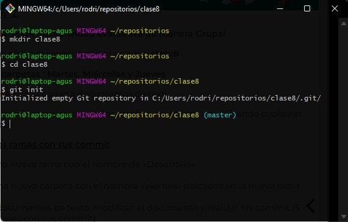
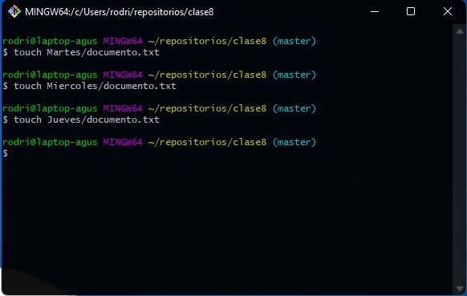
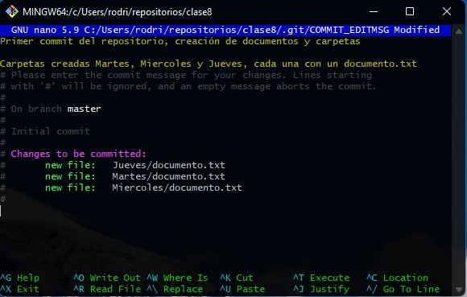
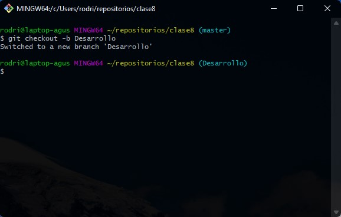
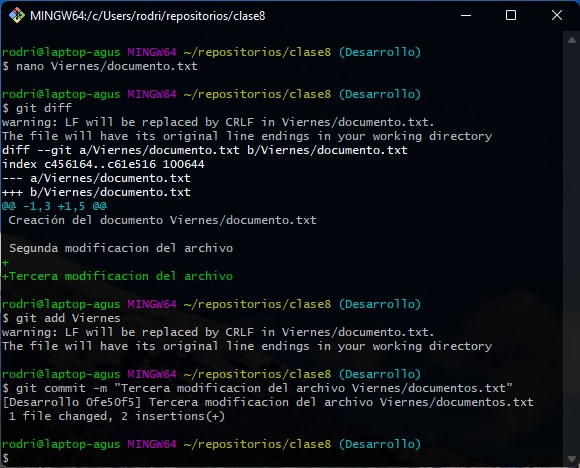
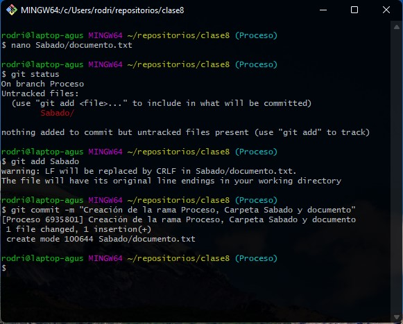
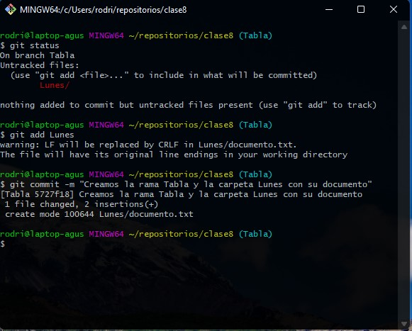
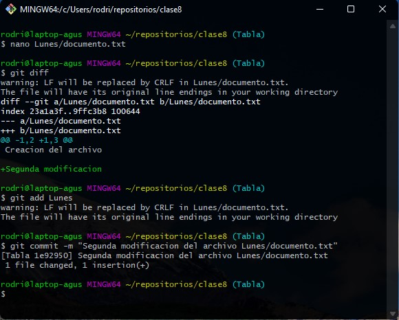
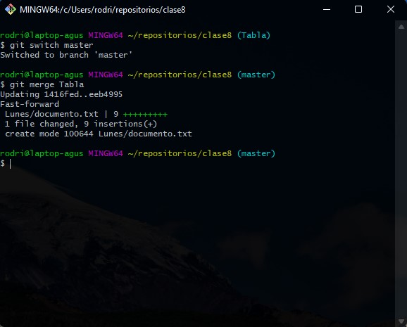
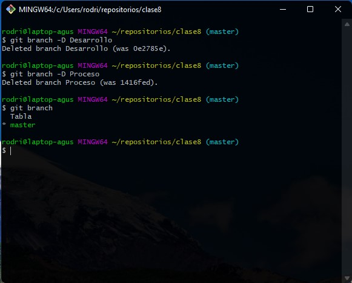

# Trabajo grupal n°3

## Integrantes del grupo

- Facundo Martin Giacomozzi
- Gabriel Romero
- Lautaro Urquiza
- Federico Pfund
- Matias Canevaro
- Eduardo Luis Gómez
- Sabrina Mantero
- Cinthia Fernanda Segovia
- Martín Alejandro Torres
- Agustin Rodriguez Alvarez

# Actividades

## Actividad n°1

Responder el cuestionario para asistencia (aula del campus)

## Actividad n°2

1. Realizar la siguiente actividad evaluativa de manera grupal

    1. Crear un nuevo repositorio con el nombre clase8
    2. Crear tres carpetas: Martes, Miércoles y Jueves
    3. Guardar en cada carpeta documentos de texto.
    4. Realizar modificaciones, añadir los cambios y hacer *commit* utilizando cualquier editor de texto.

2. Crear tres ramas con sus *commit*

    1. Crear una nueva rama con el nombre de "Desarrollo".
    2. Crear una nueva carpeta con el nombre "Viernes" ubicados en la nueva rama.
    3. Añadir documentos de texto, modificar el documento y realizar los *commit* (5 modificaciones con sus *commit*).
    4. Mergear a la rama auxiliar a la rama *main*.
    5. Creamos una nueva rama con el nombre "Proceso".
    6. Aplicamos los pasos anteriores con una nueva carpeta que diga "Sábado" añadimos documento de texto, guardamos, añadimos, *commiteamos* (5 *commit*).
    7. Y por ultimo mergeamos a la rama *main*.
    8. Estando ubicados en la *main* creamos otra rama nueva con el nombre "tabla".
    9. Aplicamos los pasos realizados en las ramas anteriores y creamos una carpeta "Lunes", añadimos documentos de texto, guardamos, añadimos, hacemos 5 *commit* y mergeamos.

3. Eliminamos ramas auxiliares

    1. Eliminamos solo dos ramas auxiliares. Tener en cuenta que para eliminar las ramas auxiliares se debe estar ubicado en la rama *main*.
    2. Comprobar la cantidad de ramas que tiene nuestro proyecto una vez eliminada las dos ramas auxiliares.
    3. Enviar capturas con el nombre del grupo y de los integrantes (indique puntos trabajados en cada captura realizada) Formato pdf, word, PowerPoint, etc.

# Resolución de la actividad

## Creamos el repositorio Clase 8

## Creamos las tres carpetas Martes, Miércoles y Jueves

## Creamos los documentos en las carpetas Martes, Miércoles y Jueves

## Modificamos los documentos

## Añadimos al área de preparación los tres documentos y las carpetas

## Comentario del primer commit

# Creamos tres ramas

## Creamos la rama Desarrollo

## Creamos la carpeta Viernes y el documento

## Editamos el documento

## Primer commit de la rama Desarrollo

## Segundo commit Desarrollo

## Tercer commit Desarrollo

## Cuarto commit Desarrollo

## Quinto commit Desarrollo

 
## Merge de la rama Desarrollo

## Creamos la rama Proceso con la carpeta Sábado y el documento de texto

## Primera edición del documento en la carpeta Sábado

## Primer commit en la rama Proceso

## Segunda modificación del documento, añadimos y hacemos commit

## Tercera modificación del documento, añadimos y hacemos commit

## Cuarta modificación del documento, añadimos y hacemos commit

## Quinta modificación del documento, añadimos y hacemos commit

## Merge Proceso con la rama Master

## Creamos la rama Tabla y la carpeta Lunes con un documento

## Primera modificación del documento 

## Hacemos el primer commit de la rama Tabla

## Hacemos la segunda modificación en la rama Tabla

## Hacemos la tercera modificación en la rama Tabla

## Hacemos la cuarta modificación en la rama Tabla

## Hacemos la segunda modificación en la rama Tabla

## Merge con la rama master

## Eliminamos dos ramas auxiliares y vemos que ramas nos quedaron

