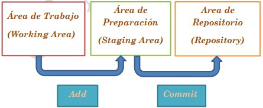

# Tres estados de git 



----

# Guía de comandos

## Comandos de Bash

### `mkdir`

Crea un directorio nuevo tomando en cuenta la ubicación actual.

### `pwd`

Nos muestra la carpeta actual en la que nos encontramos.

### `cat`

Nos permite ver el contenido de un archivo.

### `cd`

Nos permite cambiarnos de carpeta.

### `cd ..`

Nos llevara a la carpeta o directorio anterior.

### `cd -`

Nos llevara directamente al ultimo directorio visitado.

### `ls`

Nos mostrara los archivos de la carpeta donde estamos actualmente.

### `ls -l`

Ver todos los archivos como una lista donde se incluye la información del usuario, grupo, permiso sobre el archivo, tamaño y fecha y hora de creación.

### `clear`

Nos permite limpiar la pantalla

## Comandos de creación

### `git init`

Para iniciar un repositorio

## Comandos de estado

### `git status`

Nos muestra el estado de los archivos que han cambiado

### `git log`

Nos muestra el historial de nuestros *commit*

### `git log --oneline`

Nos muestra una lista ordenada de los *commit*. Sólo nos mostrará los *commit* de la rama
en la que estemos ubicados.

### `git log --oneline --all`

Me muestra una lista de todos los *commit* y todas las ramas.

### `git log --oneline --all --graph --decorate`

Nos muestra una lista de los *commit* pero con los dibujos de los *commit*
como asteriscos y las líneas de nuestras ramas.

### `git diff`

Nos muestra las modificaciones realizadas.

### `git diff --stat`

Nos muestra un resumen de las modificaciones realizadas.

### `git diff --numstat`

Nos muestra sólo de forma numérica las modificaciones en nuestro proyecto.

## Comandos de cambios

### `git add`

Añade los cambio y modificaciones a nuestra área de preparación (staging area)
para luego ser confirmados.

#### `git add "nombre del archivo"`

Para añadir archivos específicos por el nombre.

#### `git add .`

El punto después del comando `add` hace referencia a todo, osea que añadirá todos
los nuevos cambios o modificaciones.

### `git commit`

Es el comando para "confirmar" los cambios añadidos y preparados con el comando
`add` en el *staging area*, al ejecutar el comando se guarda la versión en el
repositorio y se pide que se guarde un mensaje que describa los cambios guardados
en el archivo confirmado. Después de hacer el comando `git commit`, se debe escribir 
un mensaje descriptivo del *commit*. Se puede acelerar el proceso escribiendo el 
mensaje en el comando del *commit* de la siguiente manera:

#### `git commit`

Se abre el editor que trae por defecto **Git** en mi caso nano

En la primera línea escribiremos el mensaje de nuestro *commit*, luego
saldremos con **Ctrl+S** y **Ctrl+X**.

#### `git commit -m "comentario"`

Se guarda en el repositorio el archivo y se le añade un mensaje.

#### `git commit -am "comentario"`

Se guardan todos los archivos preparados y se añade un comentario al *commit*.

### `git checkout "n° hash"`

Nos permite viajar en el tiempo en los diferente *commit* de nuestro proyecto.

### `git show`

Muestra información del *commit* específico solo cuando utilizo la etiqueta 
con comentario.

### `git stash`

Me permite generar un campo temporal en el que se va a guardar el progreso
de nuestro proyecto. Hacemos la modificación que el cliente pide y ya luego podemos 
continuaren donde lo habíamos dejado.

### `git stash pop`

Recuperamos las modificaciones en las estábamos trabajando y podremos seguir 
trabajando en ellas.

## Comandos de ramas

### `git branch`

Nos permite ver las ramas del repositorio.

### `git branch nombre_rama`

Nos permite crear una nueva rama.

### `git branch -d nombre_rama`

Borramos la rama indicada, esto es necesario después de que ya fusionamos y terminamos de usar la rama auxiliar.

### `git branch -D nombre_rama`

Elimina la rama qe estamos indicando y que no vamos a utilizar.
Siempre debemos estar ubicados en la rama *main*.

### `git branch -m master main`

Cambiamos el nombre de la rama *master* a *main*.

### `git checkout`

Este comando te permite crear ramas y te ayuda a navegar entre ellas. Por ejemplo, el siguiente comando crea una nueva y automáticamente se cambia a ella. También nos permitirá viajar entre los diferentes *commmit*.

### `git checkout -b nombre_rama`

Nos permite crear una nueva rama.

### `git checkout nombre_rama`

Nos permite movernos de una rama a otra.

### `git merge nombre_rama`

Nos permite la fusión de nuestras ramas.

### `git merge --abort`

Permite eliminar la fusión de ramas en caso de no poder solucionar un conflicto o arrepentirnos de la fusión.

## Comandos de control o seguimiento

### `git tag`

Nos muestra la lista de las versiones del proyecto.

### `git tag 'version'`

Me permite crear etiquetas para versionar un proyecto.

### `git tag -a 'version' -m 'comentario de version'`

Me permite crear una etiqueta con un comentario.

### `git tag -d 'version'`

Me permite eliminar una etiqueta.

## Banderas de estados git

Cuando vemos el estado de los archivos en git podemos encontrar las siguientes banderas. Podemos visualizarlas en `git diff`.

> - M: Modified
> - C: Copy edit
> - R: Rename edit
> - A: Added
> - D: Deleted
> - U: Unmerged

-----


# Comandos y ejercitación Git

Clase de repaso de comandos y ejercitación de clases vistas:

## Sintaxis de Git

El `~` es el ***path*** absoluto de (ruta) del usuario que estés usando, es decir la carpeta personal del usuario con el que estas logueado.

Por ejemplo, cuando entramos a la carpeta de nuestro usuario nos arroja nombre del usuario.

```
NombreUsuario@Computadora MINGW64 ~ 
$ 
```

## Guía de algunos comandos útiles 

- `pwd`: Nos muestra la carpeta actual en la que nos encontramos.
- `cat`: Nos permite ver el contenido de un archivo.
- `cd`: Nos permite cambiarnos de carpeta.
- `cd ..`: Nos permite regresar al directorio padre.
- `cd -`: Nos lleva directamente al ultimo directorio visitado.
- `ls`: Nos permite cel los archivos de la carpeta donde estamos actualmente.
- `ls -l`: Veremos todos los archivos como una lista en donde se incluye el usuario, grupo, permisos sobre el archivo, tamaño, fecha y hora de creación.
- `clear`: nos permite limpiar la pantalla.

## Comandos clase n°1

1. Crear la carpeta del repositorio:
    
    `mkdir`
2. Inicializar el repositorio:

    `git init`
3. Configuración de Usuario y Correo:

    `git config --local user.name "Nombre Usuario"`
    
    `git config --local user.email "usuario@ejemplo.com"`

## Comandos clase n°2

1. Creamos un archivo.
2. Guardamos el archivo en la carpeta dentro de las carpetas creadas en la 1ra. actividad.
3. Hacemos el `commit`.

```bash
$ git status
$ git add .
$ git commit -m "comentario del commit"
```

4. Realizamos modificaciones dentro de nuestro archivo, guardamos, añadimos y commiteamos pero ahora con el comando:

```bash
usuario@computadora MINGW64 ~/TecnicaturaGit
$ git commit -am 
```

## Comandos clase n°3

1. En nuestro editor de texto añadimos modificaciones en dos archivos
2. Luego utilizamos el comando
> `git checkout "nombre de archivo"`
 O
> `git checkout -f "nombre de archivo"`
3. Añadimos modificaciones y utilizamos
> `git add .`
4. Luego 
> `git restore --staged "nombre de archivo"`
5. `git status`
6. `git diff "nombre del archivo"`
7. `git diff --stat`
8. `git diff --numstat`

## Comandos clase n°4

En nuestra terminal de **Git Bash** ejecutar los siguientes comandos
1. `git log`
2. `git checkout hash_de_un_commit`
3. `git checkout master`
4. `git log --raw`
5. `git log --oneline`
6. `git log --oneline -n "n° de lineas"`

## Comandos clase n°5

1. Creamos una nueva rama
> `git checkout -b "nombre de la nueva rama"`
2. `git branch`
3. `git switch "nombre_de_rama"`
4. Añadimos una carpeta a nuestra nueva rama y un documento desde un editor de texto. Realizamos algunos cambios con `git add .` y `git commit -m`
5. `git merge "nombre de la rama que quiero fusionar"`
6. `git branch -D "Nombre de la rama que vamos a eliminar"`

## Comandos clase n°6

1. Git ignore
2. `git tag "n° hash"`
3. `git tag n°versión -m "comentario de la versión del pprograma" n°hash`
4. `git stash`
5. `git stash pop`

# Actividades de la clase 7

## Actividad n°1

Responder cuestionario para asistencia en el aula del campus

## Actividad n°2

Trabajo en clase
Aplicamos comando de clase numero 1 en un repositorio nuevo con nuestros Nombres

## Actividad n°3

Trabajo en clase, aplicando los comandos vistos en clase 2 y 3

## Actividad n°4

Trabajo en clase, aplicando comandos y conceptos vistos en la clase 4

## Actividad n°5 (individual)

Realizar cuestionario sobre clase 5 y 6, en el aula del campus.

## Actividad n°6 (grupal)

Desarrollar cual es la importancia de utilizar **Git**. Su funcionalidad (visto en la clase n°
6). Puede acompañar de imágenes o capturas de pantalla.

Formato de entrega: Word, PDF, Video, etc.

**Fecha de entrega: 31/05**
