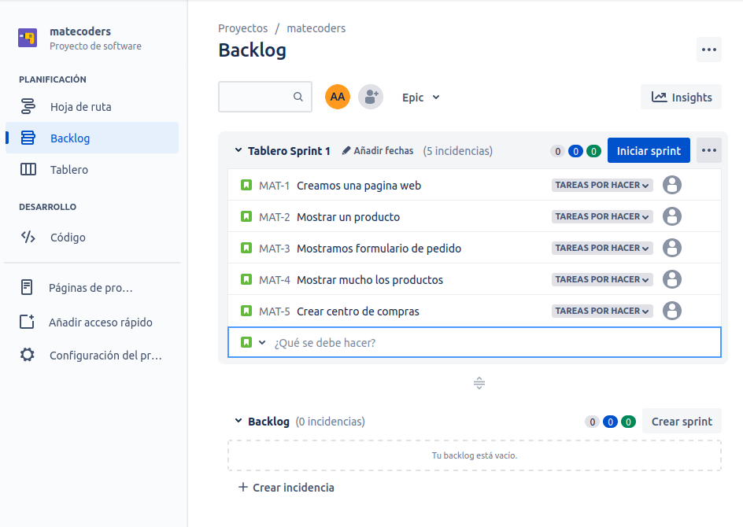

# Método Scrum
Scrum es un marco para abordar trabajos complejos como el desarrollo de nuevos productos.
Las condiciones del mercado en constante cambio y las mejoras tecnológicas van generando un alto nivel de incertidumbre.

## Constantes cambios en el mercado
Es imposible predecir desde el principio cómo debe desarrollarse un producto.
Por lo tanto, en estas condiciones es obligatorio trabajar con períodos fijos de tiempo llamadas time boxes y una adaptación rápida para garantizar que el proyecto no falle.

## Time boxes y bucles (feedback loops)
Scrum es una marco que impone time boxes y bucles de retroalimentación llamados feedback clubs e intenta lidiar con la incertidumbre.

## Sprint
Scrum analiza todos los pasos necesarios para desarrollar un producto como requisitos, análisis, diseño, desarrollo, pruebas y ponerlos en una iteración de duración fija llamada sprint.

Después de cada sprint, demuestran lo que han logrado y discuten lo que se debe hacer a continuación.

## Participación del Cliente
Los clientes a menudo necesitan ver el producto equivocado antes de poder decidir lo que realmente quieren.
Las iteraciones cortas permiten una retroalimentación y una mejora constante para qu la probabilidad de crear el producto correcto se incremente sustancialmente.

## Características del equipo scrum
El equipo debe tener todas las habilidades necesarias para cumplir con los requisitos comerciales, análisis, diseño, desarrollo, pruebas y cualquier otra cosa necesaria para que al final del sprint se cree una producto potencialmente viable.

Y todo esto en un equipo de auto organización funcional cruzado.

## Tres roles de Scrum
- Dueño del producto
- Equipo de desarrollo
- Scrum Master

### Dueño del producto 
El dueño del producto creará una lista de características denominadas *Lista del producto* y las organizará según su importancia durante la planificación del sprint.

### Equipo de desarrollo
El equipo seleccionará una lista de elementos de la parte superior de la lista del producto e intentará convertirlos en un incremento de producto potencialmente viable.

El equipo tiene un marco de tiempo fijo para completar el trabajo y se reúnen en un scrum diario para sincronizar, identificar problemas y mantener el trabajo avanzando durante el proceso.

### El Scrum Master
Mantiene la equipo enfocado en el objetivo del sprint.

## Revisión final 
Al final del sprint al incremento del producto debe poder enviarse y el equipo de Scrum y junto con las partes interesadas, realiza una revisión del producto, seguida de una retrospectiva del proceso.

Luego comienzan desde el principio con la próxima planificación de Sprint y el ciclo se repite.

## Como nace un producto 
Podemos decir con seguridad que cualquier producto que una organización decida desarrollar debe sustentar los objetivos y la visión más amplia que la organización ha definido para sí misma.

## Objetivos en Scrum
Si bien la guía de Scrum no menciona ni requiere una visión del producto, a menudo tiene sentido definirla.

El objetivo del producto representa un objetivo a largo plazo y puede verse como un paso importante hacia esa visión.

## Se puede dividir en tres pasos 
- Objetivos del sprint 
- Objetivos del producto
- Visiones del producto

### Objetivos del sprint
Cada objetivo de sprint que se alcanza y cada incremento entregado es un paso hacia el logro del objetivo del producto.

### Objetivos del producto
Representa un objetivo a lo largo plazo y puede verse como un paso importante hacia esa visión.

En un momento dado sólo hay un objetivo del producto.

Esto ayuda a dirigir la energía en una sola dirección. En lugar de correrse detrás de varias cosas al mismo tiempo, no hay cinco prioridades principales que compitan entre sí.

### Visiones del producto
Siempre debe tener una visión del producto alineada con la visión general de la organización.

## Creamos un nuevo proyecto 
## Generamos un backlog
## Generamos la lista de producto y realizamos el sprint 1
# Actividad:
1. Realizar cuestionario para la asistencia en el Aula del campus.
2. En la cuenta que crearon de Jira, Crear un proyecto "nombre del proyecto".
Se puede utilizar otra herramienta que conozcan.

Generar un backlog con la siguiente lista:
- Crear una pagina Web
- Mostrar un producto
- Mostrar formulario de pedido
- Mostrar muchos los productos
- Crear un centro de compras

Enviar captura del sprint 1 por grupo.
