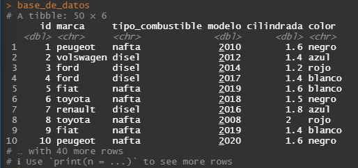
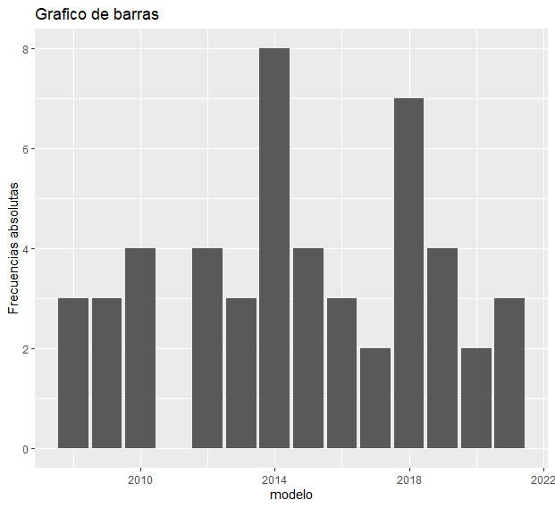
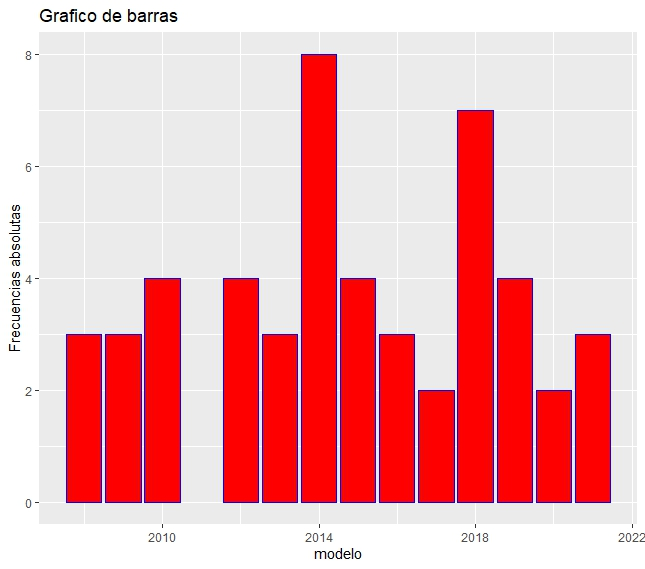
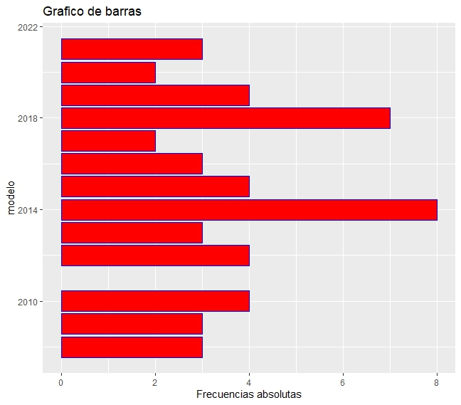
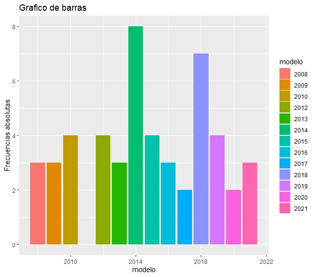
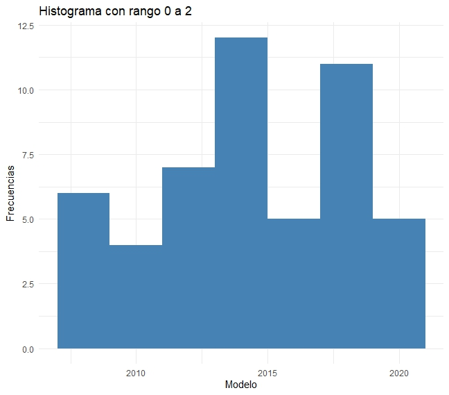
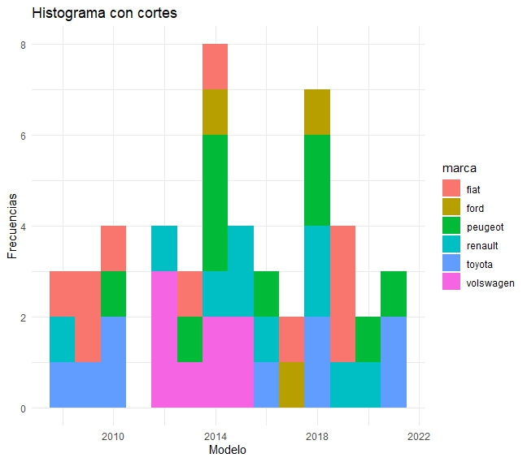
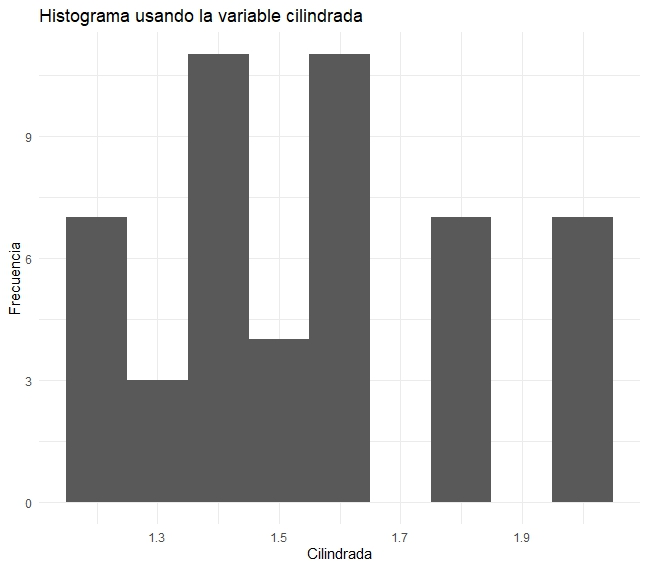
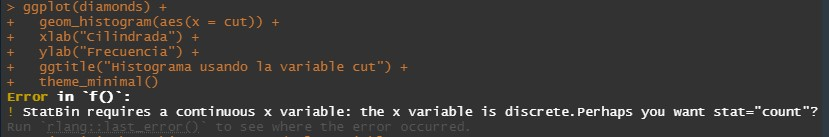
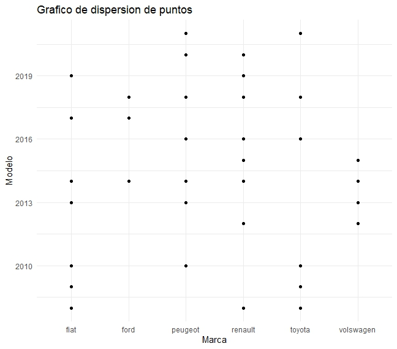

# Tp 3 parte 2 

## Grupo: MATE CODERS

### Integrantes:

- Facundo Martin Giacomozzi
- Gabriel Romero
- Lautaro Urquiza
- Federico Pfund
- Matias Canevaro
- Eduardo Luis Gómez
- Sabrina Mantero
- Cinthia Fernanda Segovia
- Martín Alejandro Torres
- Agustin Rodriguez Alvarez


## Consignas

### Con los ejemplos del practico anterior y utilizando **GGPLOT**:
1. Graficar : 
    1. `barplot`
    2. `barplot` en colores
    3. `barplot` con orientaciones cambiadas
    4. con colores distintos para cada variable.
2. Histograma:
    1. histograma en la cual cada columna tenga un rango de 0 a 2
    2. hacer un histograma haciendo cortes
    3. hacer un histograma usando la variable carat
    4. hacer un histograma usando la variable cut
    5. hacer un histograma usando la variable cut y color.
3. Gráficos de dispersión: 
    1. gráfico de puntos.


# Resolución

Empezamos importando como objeto `data`, la base de datos de el tp anterior, y también las librerías que vamos a utilizar.

```r
library(readxl)
library(ggplot2)
base_de_datos <- read_excel("../base_de_datos_tp3.xlsx")
base_de_datos
```


## Ejercicio 1.1: Gráfico `barplot` variable modelo de auto

```r
ggplot(base_de_datos, aes(x = modelo)) +
  geom_bar() +
  ylab("Frecuencias absolutas") +
  ggtitle("Grafico de barras")
```



##  Ejercicio 1.2: `barplot` con colores

```r
ggplot(base_de_datos, aes(x = modelo)) +
  geom_bar(color = "blue", fill = "red") +
  ylab("Frecuencias absolutas") +
  ggtitle("Grafico de barras")
```




## Ejercicio 1.3: `barplot` con las coordenadas invertidas

```r
ggplot(base_de_datos, aes(x = modelo)) +
  geom_bar(color = "blue", fill = "red") +
  ylab("Frecuencias absolutas") +
  ggtitle("Grafico de barras") +
  coord_flip()
```



## Ejercicio 1.4: `barplot` por distintos colores 

```r
ggplot(base_de_datos, aes(x = modelo, fill = as.factor(modelo))) +
  geom_bar() +
  ylab("Frecuencias absolutas") +
  ggtitle("Grafico de barras") +
  labs(fill = "modelo")
```



## Ejercicio 2.1: Histograma con rango 0 a 2

```r
ggplot(base_de_datos) +
  geom_histogram(binwidth = 2, aes(x = modelo), fill = "steelblue") +
  xlab("Modelo") +
  ylab("Frecuencias") +
  ggtitle("Histograma con rango 0 a 2") +
  theme_minimal()
```



## Ejercicio 2.2: Histograma usando cortes

```r
ggplot(base_de_datos) +
  geom_histogram(binwidth = 1, aes(x = modelo, fill = marca)) +
  xlab("Modelo") +
  ylab("Frecuencias") +
  ggtitle("Histograma con cortes") +
  theme_minimal()
```



> Aclaración: en este ejercicio no entendimos muy bien como realizar el histograma con cortes. Supusimos que se refería a este tipo de histograma. Donde se interpola los datos de dos variables en las columnas del histograma.

## Ejercicio b.3: Histograma usando la variable cilindrada

```r
ggplot(base_de_datos) +
  geom_histogram(binwidth = 0.1, aes(x = cilindrada)) +
  xlab("Cilindrada") +
  ylab("Frecuencia") +
  ggtitle("Histograma usando la variable cilindrada") +
  theme_minimal()
```



> Aclaración: En este ejercicio entendimos que teniamos que usar una variable de nuestra base de datos, parecida a la variable `carat` de la base de datos `diamonds`. Por eso seleccionamos la única variable que teníamos con decimales.


## Ejercicio 2.4: histograma usando la variable cut

```r
ggplot(diamonds) +
  geom_histogram(binwidth = 0.1, aes(x = cut)) +
  xlab("Cilindrada") +
  ylab("Frecuencia") +
  ggtitle("Histograma usando la variable cut") +
  theme_minimal()
```



> Aclaración: en este ejercicio tuvimos dudas interpretando la consigna. Ya que hacer un histograma con la variable `cut` de la base `diamonds` no fue posible, por ser `cut` una variable cualitativa discreta.

## Ejercicio 3: Gráfico de dispersión de puntos

```r
ggplot(base_de_datos, aes(marca, modelo)) +
  geom_point() +
  xlab("Marca") +
  ylab("Modelo") +
  ggtitle("Grafico de dispersion de puntos") +
  theme_minimal()  
```



