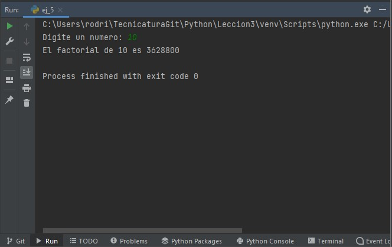
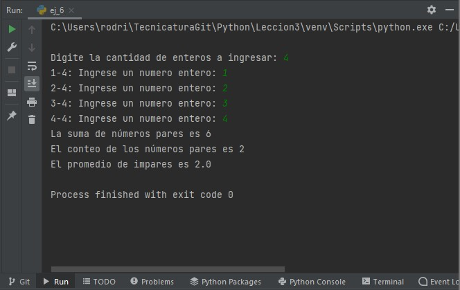

# Ejercicios grupales clase 10

### Grupo: MATE CODERS

### Integrantes del grupo

- Facundo Martin Giacomozzi
- Gabriel Romero
- Lautaro Urquiza
- Federico Pfund
- Matias Canevaro
- Eduardo Luis Gómez
- Sabrina Mantero
- Cinthia Fernanda Segovia
- Martín Alejandro Torres
- Agustin Rodriguez Alvarez


## Ejercicio 5
Calcular el factorial de un número mayor o igual a 0

```python
num = -1
while num < 0:
    num = int(input('Digite un numero: '))

i = 1
factorial = 1

while i <= num:
    factorial *= i
    i += 1

print(f'El factorial de {num} es {factorial}')
```

### Ejecución



## Ejercicio 6

Ingresar N enteros, visualizar la suma de los números pares de
la lista, cuántos números pares existen y cuál es el promedio de los
números impares.

```python
print()
n_enteros = int(input('Digite la cantidad de enteros a ingresar: '))
i = 1
suma_pares = 0
conteo_pares = 0
suma_impares = 0
conteo_impares = 0
while i <= n_enteros:
    num = int(input(f'{i}-{n_enteros}: Ingrese un numero entero: '))
    if num % 2 == 0:
        suma_pares += num
        conteo_pares += 1
    else:
        suma_impares += num
        conteo_impares += 1
    i += 1
if conteo_pares == 0:
    print('No se han ingresado números pares.')
else:
    print(f'La suma de números pares es {suma_pares}')
    print(f'El conteo de los números pares es {conteo_pares}')
if conteo_impares == 0:
    print('No se han ingresado números impares')
else:
    promedio_impares = suma_impares/conteo_impares
    print(f'El promedio de impares es {promedio_impares}')
```

### Ejecución



## Ejercicio 7

Dadas las horas trabajadas de 5 personas y la tarifa de pago,
calcular el salario y la sumatoria de todos los salarios

```python
i = 1
suma_salario = 0
while i <= 5:
    print(f'Trabajador {i}')
    horas = int(input('Ingrese las horas trabajadas: '))
    valor_hora = float(input('Ingrese el valor de la hora: '))
    salario = horas * valor_hora
    print(f'El salario del trabajador {i} es {salario}')
    suma_salario += salario
    i += 1
    print()

print(f'La suma de todos los salarios es {suma_salario}')
```

### Ejecución 

