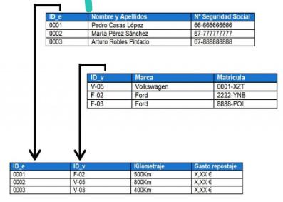

# MySQL: Elemento fundamental de una base de datos relacional
El elemento fundamental del método racional de una base de datos, es una relacional.

## Tabla 
Va a ser el espacio donde voy a organizar la información dentro de mi base de datos.
Va a contener columnas y filas.

## Tabla relacional
Es un representación extencional de una relación definida sobre un cierto dominio, decodificado o dividido en varias tablas.

## Entidad 
Una entidad es la representación de un objeto o concepto del mundo real que se describe en una base de datos. Son datos referentes.
Ejemplo de nombres de entidades: Alumno, Empleado, Artículo, Noticia.

Las entidades de describen en la estructura de la base de datos empleando un modelo de datos.

Cada entidad está constituida por uno o más atributos.

## Atributos
Un atributo representa una propiedad de interés de una entidad
Los atributos se describen en la estructura de la base de datos empleando un modelo de datos.

### Atributos representados de forma gráfica


### Atributos representados en tablas

Los atributos se representan en columnas



### Tuplas
Se define como una función que asocia unicamente los nombre de los atributos de una relación con los valores de la misma.
Es una fila de una tabla relacional.

## Clave Primaria 
Cada entidad tiene una clave primaria, campo llave o llave que identifica de forma única el conjunto de datos.
La llave primaria es un dato, el cual es único y no se repite de lo que vendría siendo una tabla o una entidad.
Me va a permitir relacionar datos.

## Clave foránea
Es cuando en una entidad figura la clave de otra entidad esta se denomina clave foránea o clave ajena.
Las entidades se relacionan entre si por medio de las claves foráneas.

## Metadatos
Son datos sobre los datos presentes en la base de datos.
Hace referencia al tipo de Dato que vamos a almacenar(texto, numero, fechas, etc.)
También el nombre que ca a recibir cada dato (nombre, apellido, fecha, edad, etc.)

## Operadores lógicos
Los operadores lógicos nos van a permitir definir sentencias asi como también llamar datos.
Operador  |  Significado
:---:|---
`=` | Igual que
`>` | Mayor que
`>=` | Mayor que o igual a
`<` | Menor que 
`<=` | Menor que o igual a
`<>` ó `!=` | Diferente que

## Función que realiza el Operador
Una función de operador de centra en uno y tres argumentos y devuelve un valor.
Cuando una sentencia SQL contiene un operador, el Servidor de bases de datos, invoca automáticamente la función del operador asociado.

## Operaciones fundamentales
- Selección
- Proyección
### Selección
- Me va a traer todos los datos de la tabla en general.
- Se va a ocupar de seleccionar filas.

En la ventana de comando nos arrojara los datos de la tabla ya sean generales o solo los que seleccionemos.

```sql
SELECT * FROM (nombre de tabla);
```
Ó
```sql
SELECT nombre, edad FROM (nombre de tabla);
```
`*` Significa todo, en el caso anterior, quiere decir nos traerá todas las columnas de la tabla estudiantes.

En cambio si especificamos los datos, solo nos arrojará los solicitados.

### Proyección
- Esta operación nos ayuda a seleccionar datos específicos.
- Sólo traerá el campo específico que se le indique.
- Se va a ocupar de seleccionar columnas.

```sql
SELECT nombre FROM estudiantes WHERE nombre = "Agustin";
```
Ó
```sql
SELECT nombre, edad FROM estudiantes WHERE nombre = "Agustin";
```

## Como ingresamos datos en nuestras tablas

```sql
INSERT INTO estudiantes (nombre, apellido, edad) VALUES ("julieta", "ramirez", 19);
```

```sql
select * from dato.estudiantes;
```
Para que me permita ingresar datos debemos ingresar nuevamente a la configuración de la tabla y seleccionar en la fila id estudiante en la opción AI (auto incrementable) y aplicamos los cambios.

# Actividad:
1. Responder el cuestionario para la asistencia en el campus
2. Realizar la siguiente actividad:
    1. Ingresar datos en la tabla creada la clase anterior.
    2. Utilizar los operadores para selección y proyección