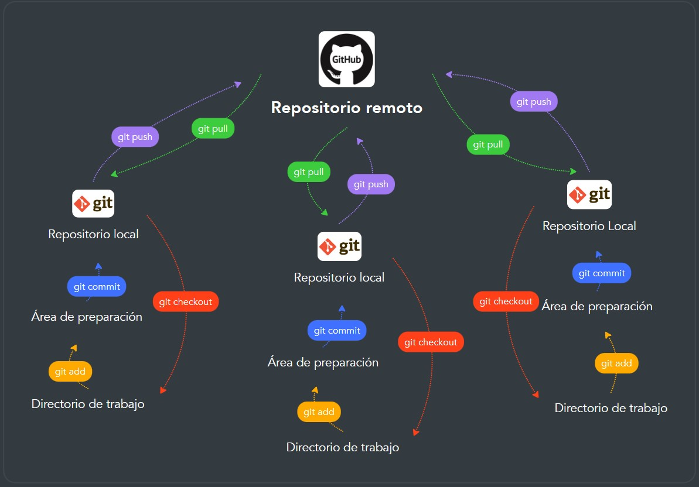

# Trabajo práctico grupal n°1
Materia: Metodología de la investigación

## Grupo: MATE CODERS

### Integrantes y sus usuarios de GITHUB:

- Facundo Martin Giacomozzi: 

        FacuG2022

- Gabriel Romero:             

        YOYI92

- Lautaro Urquiza:

        lautarouqz

- Federico Pfund:             

        federicopfund

- Matias Canevaro:

        Maty91ok

- Eduardo Luis Gómez:

        Edugomezcabj

- Sabrina Mantero:

        SabrinaJudith

- Cinthia Fernanda Segovia:

        FerSegovia91

- Martín Alejandro Torres:    

        MartinT2222

- Agustin Rodriguez Alvarez:  

        agustin1996ra

## Consignas
Realizar un trabajo grupal sobre GitHub

1. ¿Qué es GitHub?
2. ¿Cuál es la diferencia entre Git y GitHub?
3. Realizar un gráfico de como trabajamos de manera local y remota.

## Respuestas

1. ¿Qué es GitHub?

Es una plataforma que permite la creación de proyectos abiertos de herramientas y aplicaciones. Se caracteriza principalmente por sus funciones que posibilitan que otros usuarios aporten al proyecto. Está característica permite que cualquier usuario descargue o modifique el código para mejora del mismo. De igual manera, contamos con la opción de crear proyectos privados donde solo el usuario creador del proyecto puede modificarlo. 

2. ¿Cuál es la diferencia entre Git y GitHub?

La diferencia entre Git y GitHub es que en el primer caso trabajamos de manera local, en cambio en el segundo desarrollamos nuestro trabajo de manera global.

3. Realizar un gráfico de como trabajamos de manera local y remota.

