# Trabajo grupal 5

## Actividad n°1

1. Creamos una carpeta con el nombre Clase11.
2. Añadimos 1 documento de texto en el editor de texto que utilices, en cada carpeta.
3. Añadimos y commiteamos los documentos de texto.

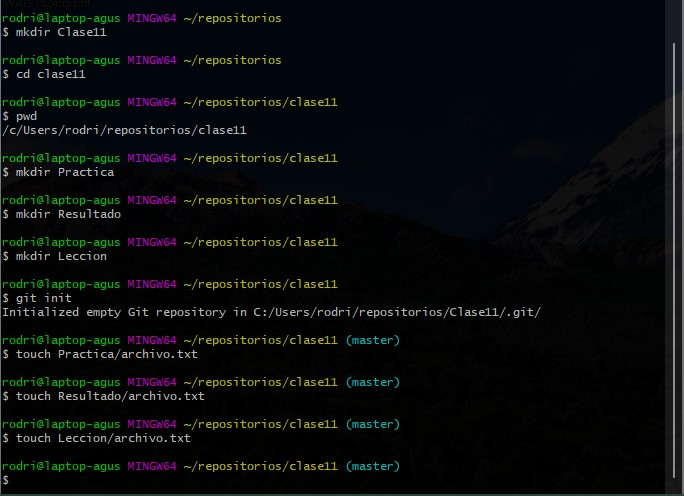

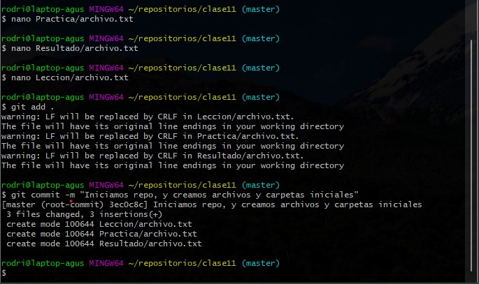

4. Volvemos a añadir unas lineas a uno de los documentos y añadimos y commiteamos.

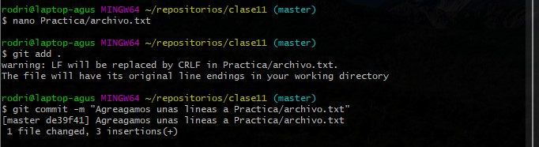

5. Añadimos 1 modificación a alguno de los documentos de texto y añadimos y commiteamos.
6. Utilizamos el comando git diff.

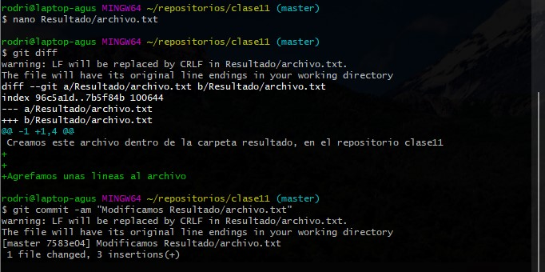

## Actividad n°2

1. Añadir 2 modificaciones a los documentos de cada carpeta.
2. Añadimos y commiteamos modificaciones.

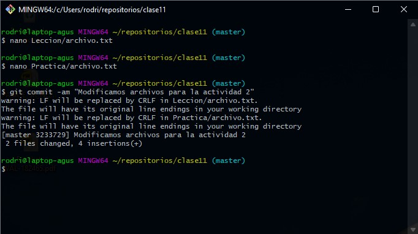

3. Seleccionar 3 commit y añadir etiquetas en cada uno de ellos.

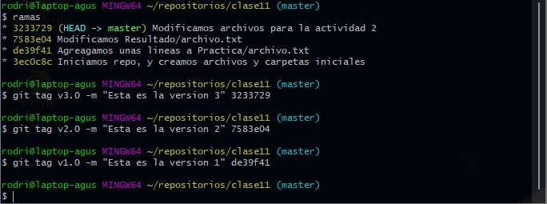

4. Utilizar el comando git show

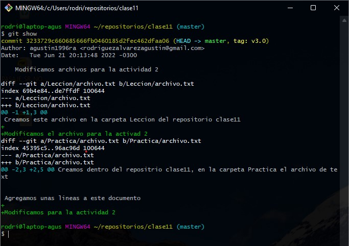

## Actividad 3

1. Añadimos una rama auxiliar a nuestro proyecto de clase11 con el nombre.
    
    - Resultado

2. Añadimos un documento de texto a nuestra rama.

3. Añadimos y commiteamos modificaciones.

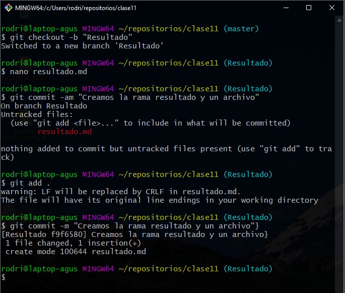

4. Realizamos fusión de la rama auxiliar a la rama master.

5. Creamos una nueva rama auxiliar a nuestro proyecto.

    - Ganancia

6. Añadimos un documento de texto a la nueva rama.

7. Añadimos y commiteamos modificaciones.

8. Realizamos fisión de la ultima rama creada a la rama master.

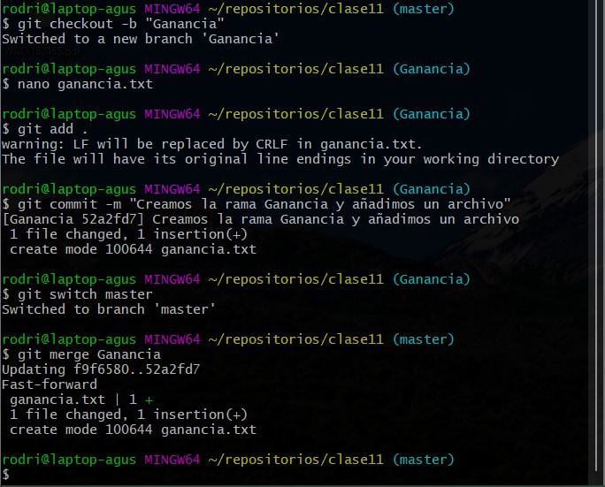

9. Eliminamos la rama auxiliar que fusionamos en el punto anterior.

10. Utilizamos el comando que me permite visualizar todas las ramas y commit de manera gráfica.

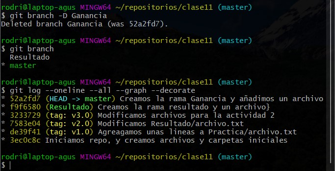

## Actividad 4

1. Creamos un documento de texto con el nombre `.gitignore`.

2. Añadimos el siguiente comentario y escribimos el nombre de uno de los documentos de la actividad n°2.

> Los siguiente archivos serán ignorados por git

3. Ejecutamos el comando `git status`

4. Añadimos y commiteamos las modificaciones.

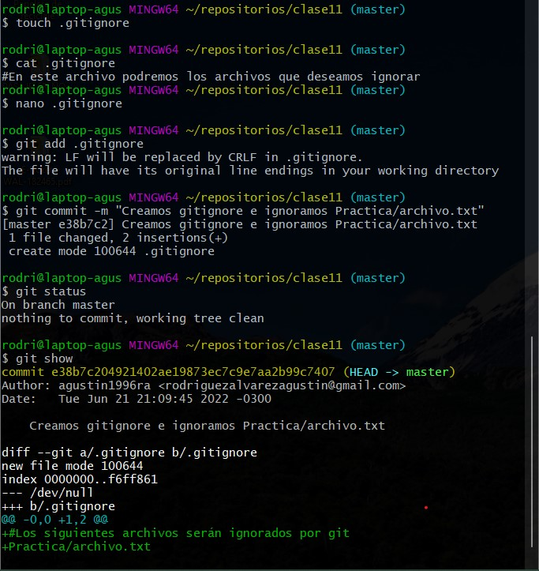
