# Clase 5

Sistema de Procesamiento de datos, clase del dia 10/05/2022

## Conceptos git 

El funcionamiento de git transcurre en tres espacios o estados de nuestro 
proyecto. Los cuales se llaman en ingles Working Directory, Staging area, Git
Repository. En castellano lo traduciriamos como carpeta de trabajo, area de 
escenificacion o montaje, almacen git.

En la **Carpeta de trabajo** es donde trbajaremos en las distintas piezas o modulos
que compondran a nuestro trabajo. Se podria decir que es donde desarrollaremos
el proyecto.

Cada vez que tengamos una pieza completada de nuestro proyecto la pasaremos al 
**area de montaje o escenificación**, en este area solo debe entrar las partes de 
nuestro proyecto que querramos agragar de foma permanente en nuestro historial.

El **almacen git** o repositorio, será este historial de los avances en nuestro 
proyecto y de las distintas versiones finales. Dentro del almacen, se pueden 
guardar varias lineas de tiempo diferentes. Las llamadas ramas.


# Comandos git y trabajo git.

## Repaso de la clase anterior

### Comandos

> - `git checkout`
> - `git log`
> - `git branch`
> - `git switch`

### Conceptos

#### `commit`

Un `commit` es un conjunto de cambios en los archivos que hemos confirmado y que 
queremos almacenar para un futuro. Los commits se relacionan unos con otros en
una o varias secuencias para poder ir viendo la historia de un determinado archivo a
lo largo del tiempo.

#### El head

Se refiere al commit que está dentro de tu repositorio posicionado en cada momento. Por 
regla general HEAD suele coincidir con el último commit de la rama en la que estés
ubicado, ya que habitualmente estás trabajando en el último. Pero si te mueves hacia 
cualquier otro commit anterior entonces el head estrá más atrás.
 
### Guiones en git

Para entender los comandos que estamos aplicando desde git bash, es importante saber 
el significado, tanto del comando como de la bandera que lo acompaña.

- **\-** (un sólo guion) acompaña una o dos letras.
    - ej: `git checkout -b`
- **\-\-** (dos guiones) acompañan una palabra.
    - ej: `git log --oneline`


### ¿Como hacer para eliminar un commit?

Para poder eliminar un commit utilizaremos el comando `git reset "hash del commit"`.

Este comando nos permite eliminar la modificacion que agrego ese commit al repositorio.

Despues de ejecutar este comando nos quedara el head en el commit que eliminamos

> Este concepto me deja algunas dudas.

### Ramas

Existe una rama predeterminada que se crea automaticamente cuando se crea un repositorio
que se llama **rama master**.

#### Actualización de este concepto

En realidad, hasta mediados del año 2020 esta rama se la llamaba **master**. Pero por 
aquel entonces, aunque existen diversas teorías sobre el origen de ese nombre, se 
decidió que al hacer referencia al esclavismo ("master" en ingles hace la 
referencia a "amo"). Y se decidio convenir en llamar a esta rama como "main", que
hace referencia a principal.

#### Nustra rama main

Por regla general a main se la considera la rama principal y la raíz de la mayoría 
de las demás ramas. Lo más habitual es que en main se encuentre el "código defintivo",
que luego va a producción, y es la rama en la que se mexclan todas las demás tarde o 
temprano para dar por finalizada una tarea e incorporarla al producto final.

En la clase n°4 estuvimos viendo como crear nuevas ramas.

Con el comando:

```
$ git checkout -b "nombre de la nueva rama"
```

Y con el comando:

``` 
$ git branch
```

Podemos ver todas las ramas que tenemos, tanto la ramas creadas como la rama main.

Como se puede apreciar en la imagen, se crea una rama auxiliar, se crean commit en 
ella y luego se fusiona nuevamente a la rama principal o rama main.

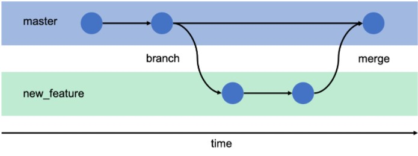

### El comando `git merge`

`git merge` es un comando que se usa para fusionar ramas independientes en una
sola rama en Git.

Cuando se usa el comando de fúsion en Git, solo se actualiza la rama actual
para reflejar la fusión y la rama de destino no se ve afectada. Esto significa que, 
a menudo, `git merge` se usa junto con `git checkout` para seleccionar la rama 
actual y `git branch` para eliminar una rama fuente desactualizada.


#### ¿Cómo funciona `git merge`?

El uso principal del comando `git merge` es fusionar dos ramas. También se utiliza
para fusionar cadenas de confirmación en un historial unificado.

Para comprender cómo funciona el comando `git merge`, tomaremos un ejemplo de 
combinación de ramas. En la siguiente ilustración, `git merge` tomarán dos ramas y
encontrará una confirmación de base común entre ellas. Cuando git encuentra una
confirmacion (commit) anterior común, crea una nueva confirmación de combinacón y
combina los cambios en la secuencia de cada confirmación de combinación. Aquí, tenemos
dos sucursales: sucursal principal y sucursal de etapa. Ahora, fusionaremos la rama
del escenario con la rama (auxiliar) del escenario (stage?) con la rama principal 
(main?).


> Siempre tener en cuenta que cuando se mezclan ramas se debe tener cuidado con los
> archivos que se han tocado. Cuando no se tocan los mismos archivos no hay 
> inconvenientes, pero cuando se tocan los mismos archivos git no sabrá cuál archivo
> agregar y habrá un conflicto.

Al utilizar el comando `git merge "nombre de la rama"` 

```
$ git merge "nombre de la rama auxiliar"
```

Se nos abrira un editor de texto donde pondremos la descripcion del 
commit que fijara la fusión. Para salir del editor usar `^S` para guardar y 
`^X` para salir.

Utilizando:

```
$ git log --oneline --all --graph --decorate
```

Nos aparecerá el commit con la fusión con el fin de la rama e integrándose a la 
Rama Master.

#### Para eliminar una fusión de ramas

En caso de que se produzca un conflicto en mis ramas, con el siguiente comando 
hacemos que cada rama vuelva a su posición original.

```commandline
git merge --abort
```

### Para eliminar una rama

Estando ubicados en la rama main, borramos la rama auxiliar que habiamos creado.

```commandline
git branch -D "nombre de la rama"
```

> No se puede eliminar una rama en la cual estamos ubicados.
> La bandera `-D` simpre debe ser en mayuscula.

Usando:

```
git log --oneline --all -- graph --decorate
```

Nos aparecerá la rama main, pero desaparece la que habíamos creado.

### ¿Como resolver conflictos en el merge de ramas?

Cuando realizas un `git merge` y te aparece un conflicto deberas proceder de la 
siguiente manera:

- Abrí tu editor de texto, alli git agregará estos dos bloques de texto:

	1. <<<<< HEAD(Current Change) (en este se mostrara en que rama estas ubicado y los
	cambios actuales)
	2. ===== (esta linea divide los bloques)
	3. >>>>> "nombre-rama" (Incoming Change) (este mostrara la rama a la cual le estas 
	haciendo el merge y sus cambios)

- Analizar cuáles cambios deben ser tomados de estas ramas.
- Borrar las línea que git agregó y dejar todos los cambios que serán utilizados.

Luego deberemos agregar la modificacion con el comando:

```
$ git add "nombre del archivo"
```

Y hacer el commit para finalizar el proceso de `merging`.

```
$ git commit -m "commentarios de nuestro merge"
```

### `git reset`

Si después de hacer varias modificaciones a un archivo de una rama auxiliar y hacerle commit a esas
modificaciones, y me arrepiento y quiero revertirlo y devolver ese archivo a como está en la rama
master, podremos hacerlo con el comando `git reset`.

Para ver el hash del commit al que se desea volver usamos:

```
$ git log
```

Luego usamos el comando `git reset`:

```
$ git reset (hash del commit)
```

Para volver al commit que pertenece a ese hash. Volveremos a un estado 
anteriorque se guarden los cambios en el commit. Podras editar 
tu area de trabajo y luego agragrlo al "saged area" y hacer un commit
para guardar esta version.

Los archivos volverán a un estado anterior, donde no habiamos 
comiteado

Si trabajaron varias ramas en un mismo archivo se pueden generar
conflictos si trabajan las mismas líneas de código.

```
$ git merge "nombre de la rama a eliminar"
```

Para abortar el `merge` si no se puede solucionar el conflicto.

```
$ git merge --abort
$ git add # añadiremos las modificaciones hechas
$ git commit -m "comentario"
$ git branch # nos apareceran las ramas
```

Para eliminar las ramas no utilizadas, no olvidarse de que debemos
poner el head en una rama que no se valla a eliminar.

```
$ git branch -D "nombre de la rama" # para eliminar las ramas no utilizadas
```

### Actividad n°2

Ejecutamos los comandos visto durante la clase.

#### Paso 1

Creamos una nueva rama llamada IMAGEN

```
$ git checkout -b "imagen"
```
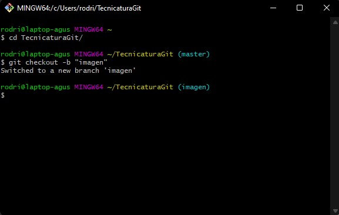

#### Paso 2

Añadiremos dos imágenes a nuestro archivo desde nuestra área de 
trabajo.

En mi caso las agregare en la carpeta "TecnicaturaGit/imagen"


#### Paso 3

Ejecutaremos, para ver los archivos que tenemos que añadir.

```
$ git status
```

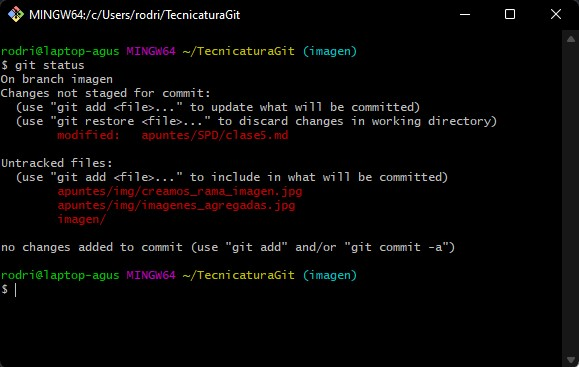

#### Paso 4

Añadimos los archivos a nuestra área de preparación

```
$ git add .
```

En mi caso usare el comando `git add imagen`, para agregar a la rama
imagen la carpeta imagen y sus archivos, por que no quiero agregar
a esta rama las modificaciones de las notas de sistemas de procesaminto
de datos.

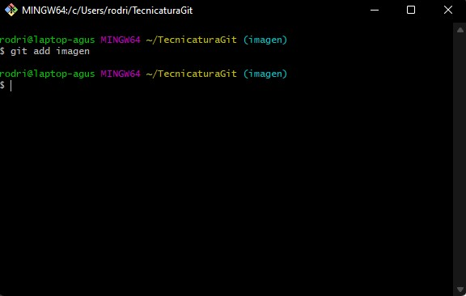


Hacemos el commit

```
$ git commit -m "comentario del commit"
```

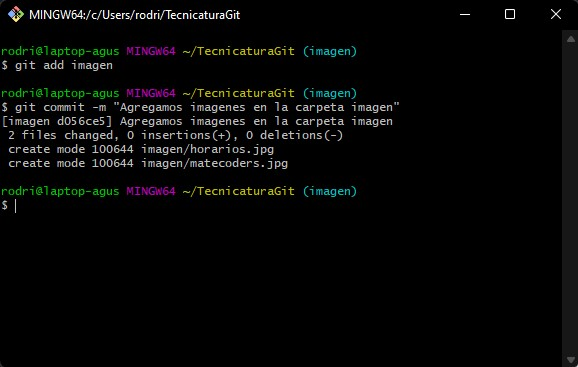

#### Paso 5

Vemos que ramas tenemos

```
git branch
```

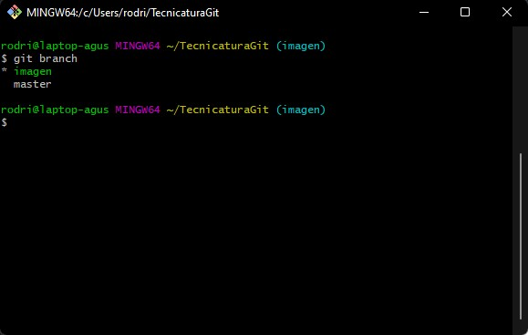

#### Paso 6

Para visualizar los commit y las ramas creadas

```
$ git log --oneline --all --graph --decorate
```

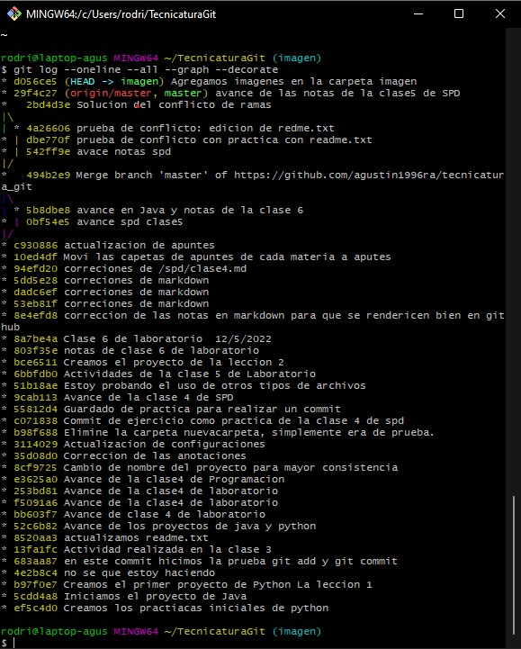

#### Paso 7

Debemos estar ubicados en nuestra rama main, usamos:

```
$ git switch master
```

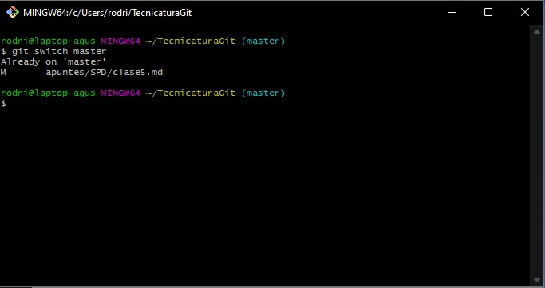

#### Paso 8

Para la fusión de las ramas

```
$ git merge "nombre de la rama que quiero fusionar"
```

Se abrira el editor de codigo para dar el comantario del commit
de la fusion.

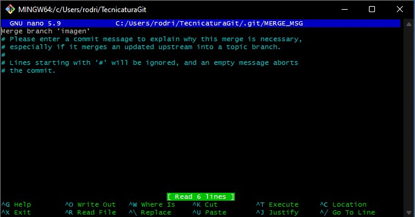

Luego volveremos a la consola ye veremos la información de la fusion.

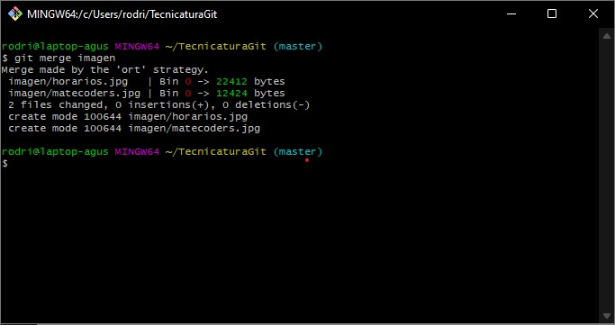

#### Paso 9

Usamos:

```
$ git log --oneline --all --graph --decorate
```

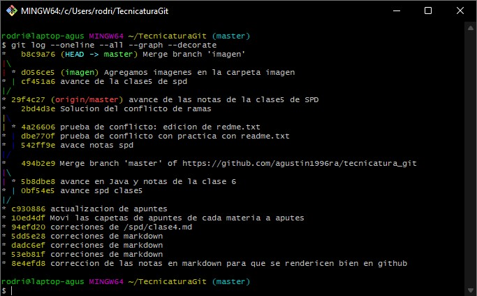

#### Paso 10

Eliminamos la rama que ya no vamos utilizar

```
$ git branch -D "nombre de la rama que vamos a eliminar"
```


#### Paso 11

Creamos otra rama y usamos el mismo archivo `readme/readme.txt` en
las dos ramas (auxiliar y main), esto generará un conflicto.

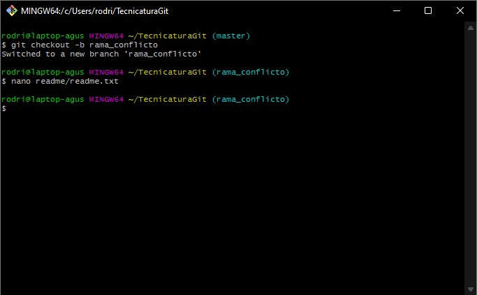

Edito el archivo readme para genera el conflicto
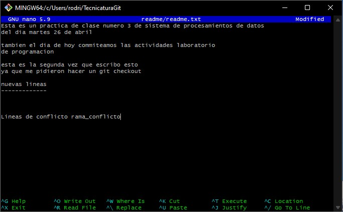

Edito el archivo readme en la rama master para generar el conflicto.
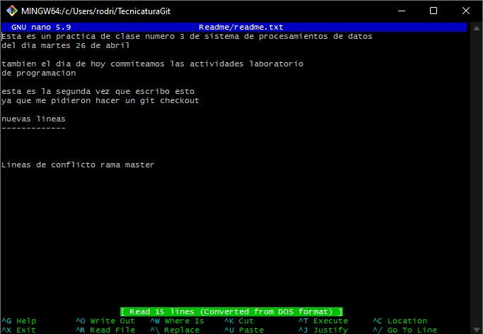


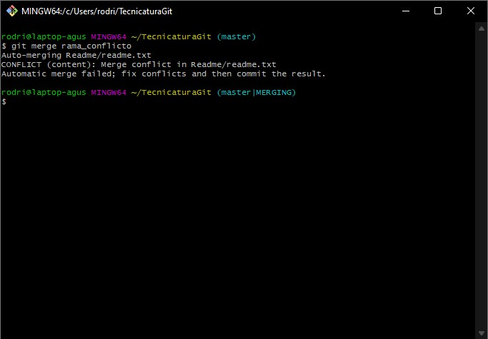

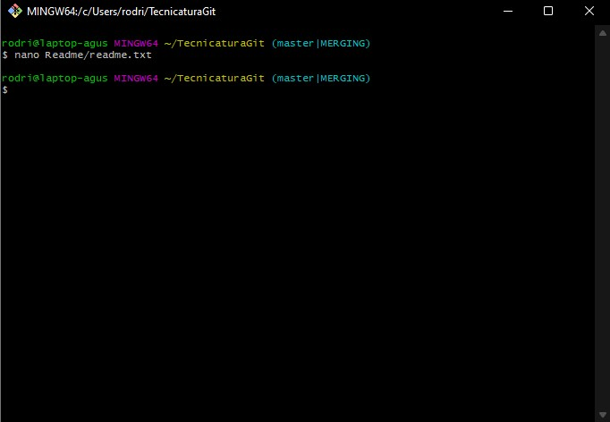

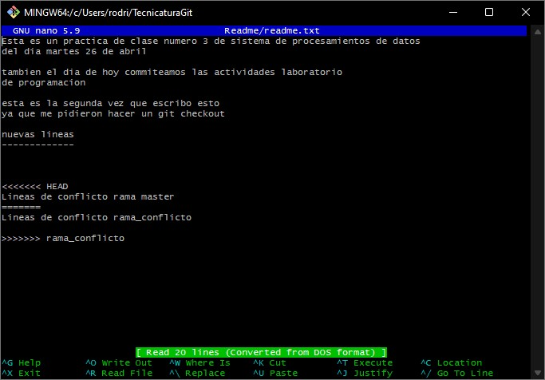

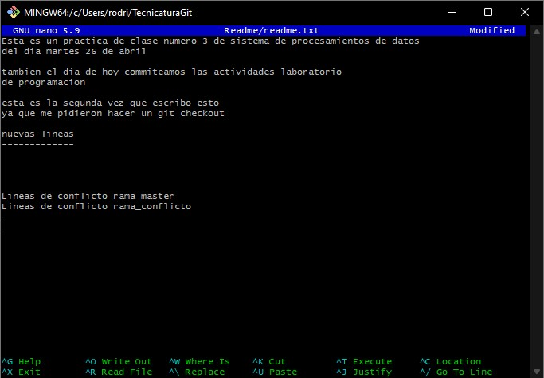

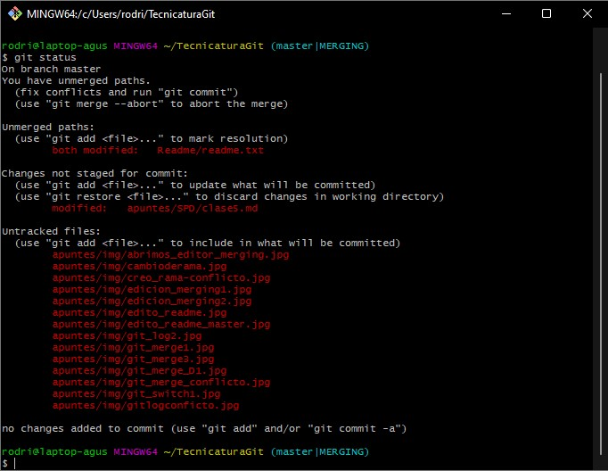

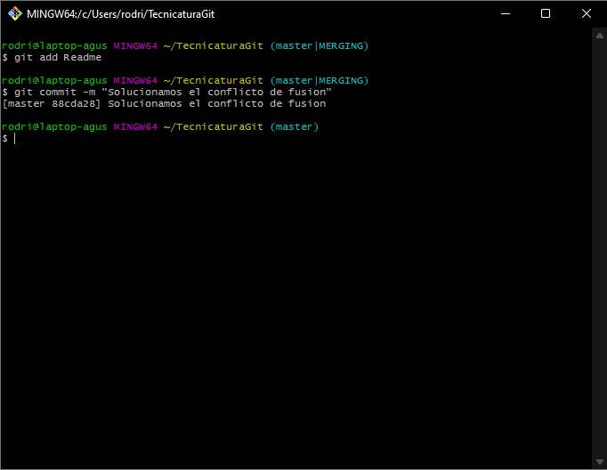

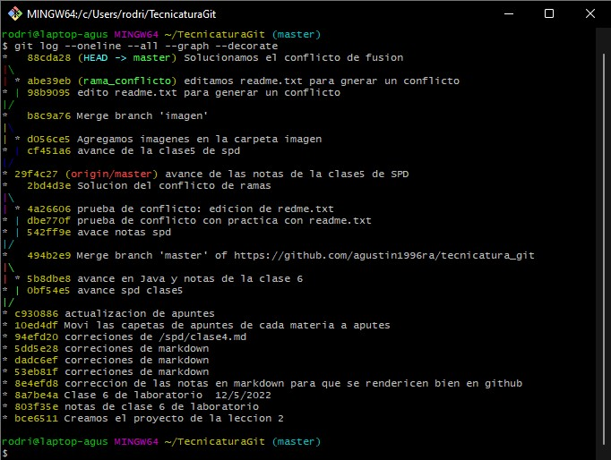


#### Paso 12

Eliminamos el merge con 

```
$ git merge --abort 
```

Para elimnar la fusión de ramas

#### Paso 13

Podremos ver las ramas que nos quedan

```
$ git branch 
```