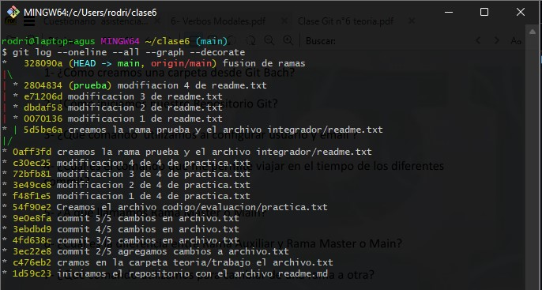
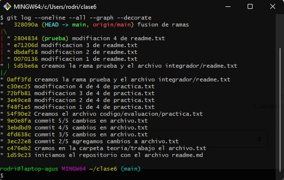

# Actividad n° 6

## Grupo: MATE CODERS

### Integrantes:

- Facundo Martin Giacomozzi
- Gabriel Romero
- Lautaro Urquiza
- Federico Pfund
- Matias Canevaro
- Eduardo Luis Gómez
- Sabrina Mantero
- Cinthia Fernanda Segovia
- Martín Alejandro Torres
- Agustin Rodriguez Alvarez

## Consignas

1. ¿Cómo creamos una carpeta desde **Git Bash**?
2. ¿Cómo iniciamos nuestro *repositorio git*?
3. ¿Qué comando utilizamos al configurar usuario y email?
4. ¿Cuál es el comando que permite viajar en el tiempo de los diferentes *commit*?
5. ¿A que llamamos *rama master* o *main*?
6. ¿Cuál es la diferencia entre *rama auxiliar* y *rama main*?
7. ¿Qué comando utilizamos para cambiar de una rama a otra?
8. ¿Se puede modificar la *rama master*?
9. ¿Cuál es el comando para crear una nueva rama?
10. Mencionar 3 funcionalidades que tiene el comando `git checkout`.
11. ¿Cuál es el comando que me permite ver de manera gráfica los *commit* y las *ramas* creadas?
12. Realizar una captura del ultimo punto realizado, se puede utilizar captura de la actividad n° 4.


## Respuestas

### 1. ¿Cómo creamos una carpeta desde **Git Bash**?

Para crear una carpeta desde **Git Bash** utilizaremos el 
comando `mkdir`. Teniendo en cuenta la dirección en la que 
nos encontramos en el sistema de archivos, este espacio 
alojará nuestra nueva carpeta, utilizando el comando de este 
modo.

```bash
usuario@computadora MINGW64 ~
$ mkdir nombre_nueva_carpeta
```

> **Nota:** Tener en cuenta que el símbolo `~` nos indica que 
> estamos en la carpeta de usuario, en este caso sera:
> `/c/Users/usuario/`

Si deseamos poner un nombre de carpeta dejando espacio entre 
las palabras que conforman al nombre deberemos ponerlo entre 
comillas.

```bash
usuario@computadora MINGW64 ~
$ mkdir "nombre nueva carpeta"
```

> **Nota:**  Tener en cuenta que el uso de nombres de carpetas
> con espacios puede traernos problemas, ya que las 
> direcciones de capetas que contengan espacios siempre 
> deberán escribirse entre comillas.

### 2. ¿Cómo iniciamos nuestro *repositorio git*?

Para iniciar nuestro *repositorio git*, debemos 
posicionarnos en la carpeta que contendrá nuestro 
repositorio, y luego ejecutaremos el comando `git init`.

```bash
usuario@computadora MINGW64 ~/repositorio
$ git init
```

> En este caso el nombre de la carpeta que contiene nuestro
> repositorio se llama `/repositorio` y su dirección completa
> es `/c/Users/usuario/repositorio` 

Luego de usar el comando `git init`, veremos que **Git Bash**
nos indicara en que rama estamos. Esto nos comprueba que el 
repositorio fue iniciado. El nombre de la rama se mostrara 
entre paréntesis al lado derecho de la dirección actual.  

```bash
usuario@computadora MINGW64 ~/repositorio (main)
$ 
```

### 3. ¿Qué comando utilizamos al configurar usuario y email?

El comando que se utiliza para configurar el usuario de 
manera global es:

```bash
usuario@computadora MINGW64 ~/repositorio (main)
$ git config --global user.name "nombre de usuario"
```

Y el que utilizaremos para configurar el email del usuario es:

```bash
usuario@computadora MINGW64 ~/repositorio (main)
$ git config --global user.email "nombre@example.com"
```

Para ver que configuraciones tenemos guardadas usaremos el 
comando:

```bash
usuario@computadora MINGW64 ~/repositorio (main)
$ git config -l
```

Nos mostrara una lista con todas las configuraciones 
aplicadas a **Git Bash**.

### 4. ¿Cuál es el comando que permite viajar en el tiempo de los diferentes *commit*?

El comando que nos permite viajar en el tiempo es `git 
checkout <hash>`

Lo utilizaremos de la siguiente manera:

Primero debemos obtener el hash usando `git log --oneline`

> **Nota:** debemos tener en cuenta que el comando `git log --oneline` nos 
> mostrara solo los primeros 7 caracteres del hash del commit,estos sirven perfectamente para dar la indicación de donde queremos viajar. Otro sera el resultado del comando `git log`
> que nos mostrara el hash completo de los *commit*.

Después usaremos el numero de hash al *commit* que deseamos 
viajar, como veremos en el siguiente ejemplo:

```bash
usuario@computadora MINGW64 ~/repositorio (main)
$ git checkout 14f5fd6
```

En este caso viajaremos al *commit* con el hash `14f5fd6`.
Como veremos nos aparecerá marcado entre paréntesis al lado
de la dirección de la carpeta actual.

```bash
usuario@computadora MINGW64 ~/repositorio ((14f5fd6...))
$ 
```

### 5. ¿A qué llamamos *rama master* o *main*?

Llamamos rama *master* o *main*, a una linea de tiempo de 
*commits*, esta en particular es la rama principal de un
repositorio. Se crea por defecto en el inicio de un 
repositorio y en esta deberán estar las versiones principales 
de nuestro proyecto.

### 6. ¿Cuál es la diferencia entre rama *auxiliar* y rama *main*?

La diferencia principal es que la rama *main*, será nuestra 
rama principal en esta deberán estar todas las modificaciones
y archivos para que nuestro proyecto funcione. En cambio
en una rama *auxiliar* se desprende de la rama *main* o de 
otra rama *auxiliar*, y en esta se trabajara en paralelo de la
rama *main* hasta que las tareas por las que se creo esta rama
se hayan cumplido, una vez pase esto se pasara a fusionar la
rama *auxiliar* con la rama *main*, y se dará comienzo a una 
nueva version de nuestro proyecto.

### 7. ¿Qué comando utilizamos para cambiar de una rama a otra?

Para ello utilizaremos el comando `git switch`, dando como 
dato el nombre de la rama a la que queremos cambiar

```bash
usuario@computadora MINGW64 ~/repositorio (main)
$ git switch rama_auxiliar
usuario@computadora MINGW64 ~/repositorio (rama_auxiliar)
$ 
```

### 8. ¿Se puede modificar la rama *master*?

Si se puede cambiar su nombre por *main*, esto se hace
principalmente por que en ingles el termino *master*
hace referencia al esclavismo. Era la forma de referirse
a el 'amo', aquella persona que poseía uh ser humano como 
esclavo.

Para hacer este cambio de nombre se utiliza el comando:

```bash
usuario@computadora MINGW64 ~/repositorio (master)
$ git branch -m master main
usuario@computadora MINGW64 ~/repositorio (main)
$ 
```

Este comando no es perdurable, lo que quiere decir es que 
volverá a llamarse *master*, cuando cerremos y volvamos a 
abrir **Git Bash**. 

Para hacerlo de forma permanente debemos usar el comando: 

```bash
usuario@computadora MINGW64 ~/repositorio (master)
$ git config --global init.defaultbranch master main
```

De esta manera cada vez que iniciemos el programa se cambiara 
el nombre de nuestra rama *master*.

### 9. ¿Cuál es el comando para crear una nueva rama?

Para crear una nueva rama usaremos el comando `git checkout`
con la bandera `-b` continuado por el nombre de la nueva rama.

```bash
usuario@computadora MINGW64 ~/repositorio (main)
$ git checkout -b rama_auxiliar


usuario@computadora MINGW64 ~/repositorio (rama_auxiliar)
$ 

```

### 10. Mencionar 3 funcionalidades que tiene el comando `git checkout`

#### 1. Crear ramas

Como vimos en el ejercicio anterior con el comando `git 
checkout -b` y un nombre podemos crear una rama.

```bash
usuario@computadora MINGW64 ~/repositorio (main)
$ git checkout -b rama_auxiliar


usuario@computadora MINGW64 ~/repositorio (rama_auxiliar)
$ 

```

#### 2. Viajar en el tiempo 

Con el comando `git checkout` y un hash en especifico 
podremos trasladar el `HEAD` nuestro puntero. Y viajaremos 
al estado en que teníamos nuestro repositorio a la hora de 
hacer ese *commit*.

Ejemplo:

```bash
usuario@computadora MINGW64 ~/repositorio
$ git checkout 14f5fd6

usuario@computadora MINGW64 ~/repositorio ((14f5fd6...))
$ 
```

#### 3. Ir al ultimo *commit* de la rama seleccionada

En el caso de que usemos el comando `git checkout` continuado
del nombre de una rama moveremos el `HEAD` al último
*commit* de la rama seleccionada.


```bash
usuario@computadora MINGW64 ~/repositorio ((14f5fd6...))
$ git checkout rama_auxiliar
Previous HEAD position was 14f5fd6 commit
Switched to branch 'rama_auxiliar'

usuario@computadora MINGW64 ~/repositorio (rama_auxiliar)
$
```

### 11. ¿Cuál es el comando que me permite ver de manera gráfica los *commit* y las ramas creadas?

El comando que debemos ejecutar para poder ver las ramas y 
todos los *commit* de estas graficados, de una manera un poco
mas visualmente entendible es:

```bash
usuario@computadora MINGW64 ~/repositorio (main)
$ git log --oneline --all --graph --decorate
```

Un ejemplo de la salida de este comando:


### 12. Realizar una captura del ultimo punto realizado, se puede utilizar captura de la actividad n°4.

