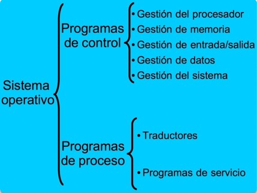

# Clase 3: Sistemas Operativos

## Componentes de un sistema operativo:

El sistema operativo está compuesto por un conjunto de programas que se pueden agrupar en programas de control y programas de proceso.

## Esquema general de los sistemas operativos:

### Programas de control

Los programas de control se dedican a coordinar el funcionamiento de todos los recursos y elementos de la computadora, es decir, el procesador, la memoria, las operaciones de entrada/salida, la información y en definitiva todo el entorno del sistema incluidos los periféricos. Se encuentran en el núcleo o kernel.

Dentro de los programas de control, podemos mencionar:

### Programa de proceso:

Los programas de proceso sirven para ayudar al programador en su tarea de escribir aplicaciones. Los hay de dos tipos:

- Programas traductores: toman un programa escrito en un lenguaje simbólico y lo "traduce" a un lenguaje comprensible para el computador. Dentro de los programas traductores se encuentran ensambladores, compiladores y programas intérpretes.
- Programas de servicio: también denominados "utilidades" o *Utilities*, son un grupo de programas que realizan funciones de manipulación de datos y el mantenimiento del sistema operativo.

## Evolución de los sistemas operativos:

La evolución de los sistemas operativos se puede resumir en cinco niveles a medida que se construyen computadores más complejos.

### Primer nivel

- Sistemas operativos básicos.
- Surgen en los años cincuenta del siglo XX.
- Lenguaje de programación: FORTRAN.
- Se programaba en tarjetas perforadas.

### Segundo nivel

- Aparece en los años sesenta del siglo XX.
- Aumenta el rendimiento de utilización del procesador.
- Aparecen los procesos on-line (conectado directamente a la computadora) y off-line (conexión a través de otros dispositivos más rápidos).
- Aparecen las técnicas de buffering y spooling. El buffering es cuando se almacenan los datos en memorias intermedias o buffer. El spooling es cuando es cuando se almacenan los datos en discos magnéticos.

### Tercer nivel

- Aparece en los años setenta del siglo XX.
- Aparece la multi programación: ejecución de varios programas en un mismo procesador.

### Cuarto nivel

- Aparece en los años ochenta del siglo XX.
- Se mejora la seguridad a través de la conexión en paralelo de varias computadoras, que comparten memoria, buses y terminales.
- La velocidad de los procesos aumenta con el uso de multiproceso: computadoras que tienen más de una procesador.

### Quinto nivel

- Sistemas operativos para sistemas móviles.

## Ejemplos de sistemas operativos 

### MS/DOS

El sistema operativo DOS, por las siglas *Disk Operating System* MS/DOS fue diseñado por *Microsoft* para las computadoras personales IBM en 1981. MS/DOS podía administrar discos floppy y archivos, memoria y dispositivos de entrada y salida. Se controla a través de comandos.

### Microsoft Windows

El 