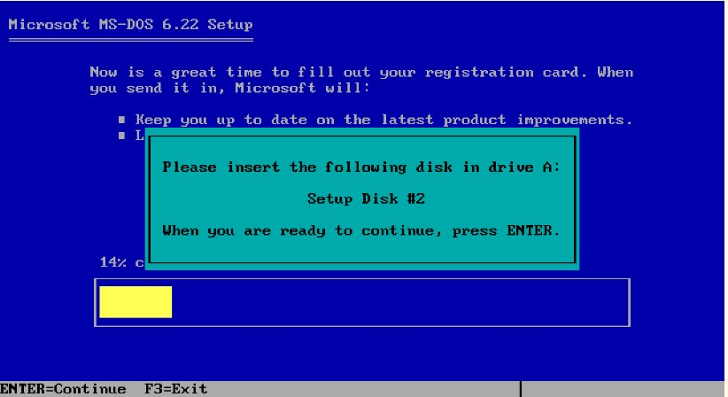

# Tp grupal MS-DOS

## Grupo: MATE CODERS

### Integrantes:

- Facundo Martin Giacomozzi
- Gabriel Romero
- Lautaro Urquiza
- Federico Pfund
- Matias Canevaro
- Eduardo Luis Gómez
- Sabrina Mantero
- Cinthia Fernanda Segovia
- Martín Alejandro Torres
- Agustin Rodriguez Alvarez

## Consignas
1. Describe el origen de MS-DOS.
2. Requerimientos de hardware.
3. Que similitud encontraste con GitBash. Menciona algunos ejemplos, puedes acompañar de capturas o imágenes.

# Respuestas

## 1. Describe el origen de MS-DOS
El sistema operativo `MS-DOS` (de las siglas en ingles **M**icro**S**oft **D**isk **O**perating **S**ystem), es parte de la familia DOS. Este sistema operativo fue lanzado en 1982, para las computadoras personales de IBM las PC. Este sistema operativo es un evolución del sistema `QDOS`, y su ultima version estable fue la 8.0, lanzada dentro de **Windows ME** en septiembre de 2000. Esta fue remplazada por versiones de **Windows** que corrían directamente una interfaz gráfica.

El inicio de las interfaces gráficas de **Microsoft** empieza dentro del periodo MS-DOS, la empresa distribuía su sistema operativo que contenía un programa ejecutable que se llamaba `windows.exe` este una ves iniciado el sistema operativo, al ser ejecutado por el usuario, le abría en pantalla un sistema gráfico de ventanas. Este fue el camino de transición hasta que directamente se empezaron a distribuir versiones de **Windows** a secas, sin interfaz textual como medio de interacción principal con el usuario.

El **MS-DOS** tiene como antecesor el **QDOS**, un sistema comprado por **Microsoft** a la empresa **Seattle Computer Products**. Este desarrollo de **Microsoft** fue por un encargo de la empresa **IBM**, para que este fuera distribuido con las computadoras personales de la linea **PC**. Su desarrollo comenzó en 1981 y fue lanzado en 1982 como **MS-DOS 1.0**. Tuvo ocho versiones y fue de los principales sistemas operativos, hasta que fue remplazado por sistemas operativos de interfaz gráfica.

### Versiones
- MS-DOS 1.0 (1982)
- MS-DOS 1.1 (1982)
- MS-DOS 1.25 (1982)
- MS-DOS 2.0 (1983)
- MS-DOS 3.0 (1984)
- MS-DOS 3.3 (1987)
- MS-DOS 4.0 (1988)
- MS-DOS 5.0 (1991)
- MS-DOS 5.2 (1992)
- MS-DOS 6.0 (1993)
- MS-DOS 6.22 (1994)
- MS-DOS 7.0 (1995)
- MS-DOS 8.0 (2000)

## 2. Requerimientos de Hardware

El sistema operativo **MS-DOS** si bien fue desarrollado para la linea **PC** de **IBM**, este era compatible con gran cantidad de las computadoras personales de la competencia. Este era compatible con los procesadores de tecnologías x86, en este caso los **Intel 8086**. Aparte de de ser compatible con este tipo de procesador, la computadora debía contar con al menos:

Version 1.0 (características de PC IBM)
- 64 Kb de memoria RAM.
- Dos disqueteras de 5,25 pulgadas con de capacidad de 160Kb.
- CPU 8088 de 8bits y 4.7
- Adaptador gráfico VGA.

## 3. Que similitud encontraste con **GitBash**. Menciona algunos ejemplos, puedes acompañar de capturas o imágenes.

Por empezar tanto MS-DOS como GitBash, es software que no posee interfaz gráfica, es decir que son de interfaz textual, y el usuario deberá ingresar los comandos por teclado para realizar sus actividades.

Hay algunos comandos que comparten estos dos sistemas, tanto `cd` como `mkdir`, son comandos que se pueden utilizar tanto en sistemas basados en **DOS**, como en sistemas **BASH**. Y ambos ser sistemas de interfaz textual, tienen comportamiento muy similares, y formas de sintaxis para poder utilizar sus comandos prácticamente idénticas.

### Ejemplos de comandos en MS-DOS

### Instalación de MS-DOS

### Probando MS-DOS

> Estas pruebas las realizamos en la pagina https://www.pcjs.org/software/pcx86/sys/dos/microsoft/6.22/ , que permite emular una IBM PC e ir insertando los floppy disk para instalarlo, y luego correr el sistema operativo. Todo esto funciona de forma online en el navegador.
