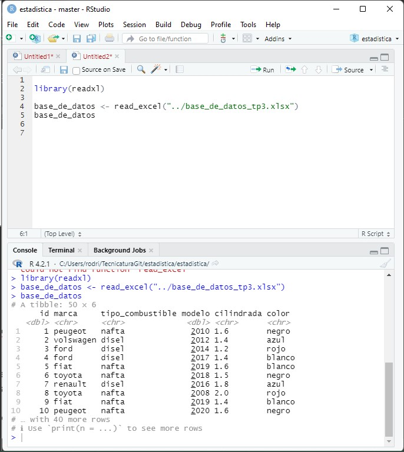
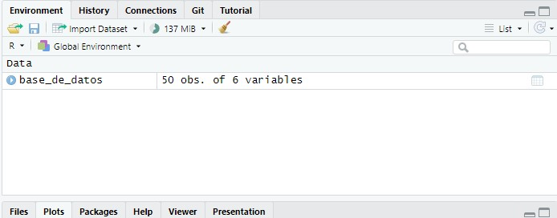
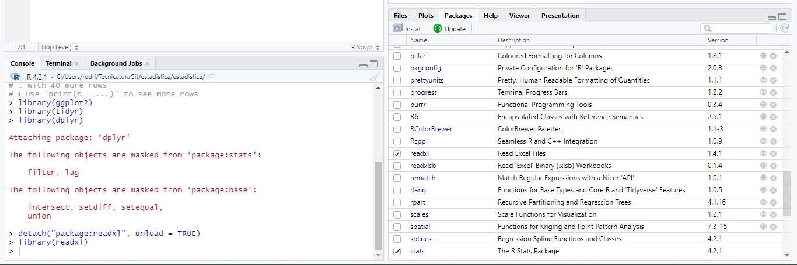
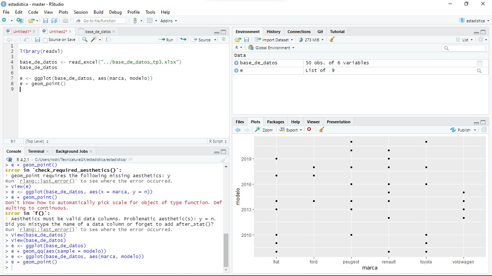
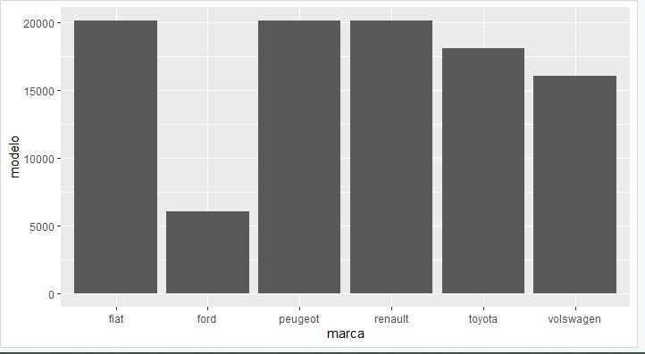
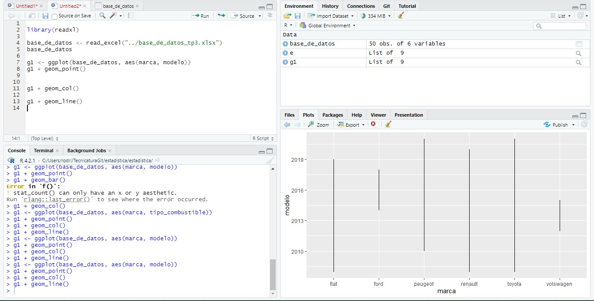
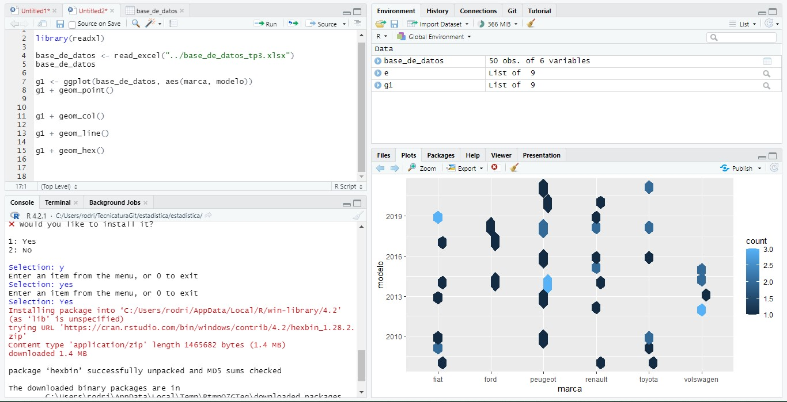
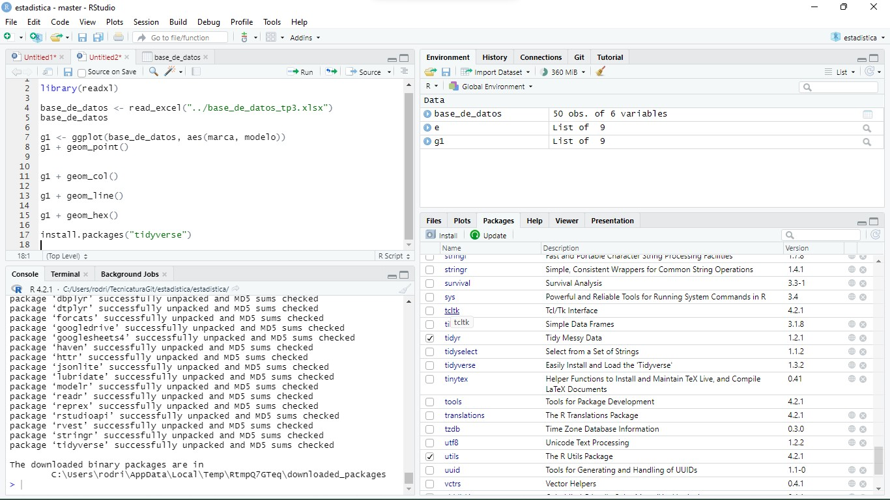
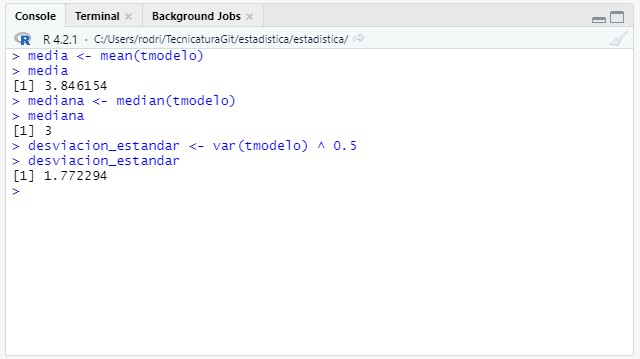

# Trabajo practico n°3

### Grupo: MATE CODERS
### Agustin Rodriguez Alvarez
### rodriguezalvarezagustin@gmail.com

## Consignas

1. Generar en Excel una base de datos que tenga al menos 50
registros o mas, como minimo 5 campos, con datos numéricos y
alfanuméricos.

2. Generar luego en R-ESTUDIO, un script que muestre dicho archivo
(en la solapa de script) captura de pantalla.

3. En la solapa de variables y observaciones mostrar las variables del
script (captura de pantalla)

4. Instalar en la solapa inferior derecha las librerías tidyr, readxl,
ggplot2, dplyr

5. Con dos de las columnas de la tabla seleccionada generar un
grafico usando ggplot2 y mostrar graficos de puntos, barra, lineal y
fraccionado. (captura de pantalla)

6. Instalar una nueva librería que se llama tidyverse (captura de
pantalla)

7. Usando esta librería calcular la media, mediana y desviación
estándar. (en la solapa de consola) captura de pantalla del uso de
la librería) y mostrar resultados.

