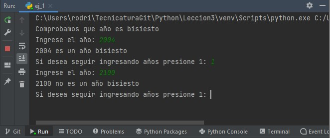

# Ejercicios grupales de Laboratorio
Clase miercoles 15 de junio.

## Grupo: MATE CODERS

## Integrantes del grupo

- Facundo Martin Giacomozzi
- Gabriel Romero
- Lautaro Urquiza
- Federico Pfund
- Matias Canevaro
- Eduardo Luis Gómez
- Sabrina Mantero
- Cinthia Fernanda Segovia
- Martín Alejandro Torres
- Agustin Rodriguez Alvarez


# Ejercicio 1

Diseñar un programa que ingresando un año, nos devuelva
por consola si es un año bisiesto o no, repetir la acción
hasta que el usuario lo decida.

```python
print('Comprobamos que año es bisiesto')
opcion = 1
while opcion == 1:
    anio = int(input('Ingrese el año: '))
    if ((anio % 4 == 0) and (anio % 100 != 0)) or (anio % 400 == 0):
        print(f'{anio} es un año bisiesto')
    else:
        print(f'{anio} no es un año bisiesto')
    opcion = int(input('Si desea seguir ingresando años presione 1: '))
```

## Ejecución:




# Ejercicio 2

Calcular la suma de "N" primeros números

```python
n = int(input('Ingrese la cantidad de números a sumarse: '))
suma = 0
i = 0
while i <= n:
    suma = suma + i
    i += 1

print(f'La suma de los primeros {n} números es {suma}')
```

## Ejecución


# Ejercicio 3

Leer 10 números e imprimir cuantos son positivos, cuantos
negativos y cuantos neutros.

```python
positivos = 0
negativos = 0
neutros = 0
for i in range(10):
    num = int(input('Ingrese un número: '))
    if num > 0:
        positivos += 1
    elif num < 0:
        negativos += 1
    elif num == 0:
        neutros += 1

print(f'La cantidad de números positivos es {positivos}')
print(f'La cantidad de números negativos es {negativos}')
print(f'La cantidad de números neutros es {neutros}')
```

## Ejecución


# Ejercicio 4

Suponga que se tiene un conjunto de calificaciones de un grupo de
10 alumnos. Realizar un algoritmo para calcular la calificación
promedio y la calificación más baja de todo el grupo.

```python
total = 0
nota_baja = 100
for i in range(10):
    nota = int(input(f'Introduzca la nota del alumno {i+1}: '))
    total = total + nota
    if nota <= nota_baja:
        nota_baja = nota

promedio = total / 10
print(f'El promedio de las notas de los 10 alumnos es {promedio}')
print(f'La nota mas baja es {nota_baja}')
```

## Ejecución 

