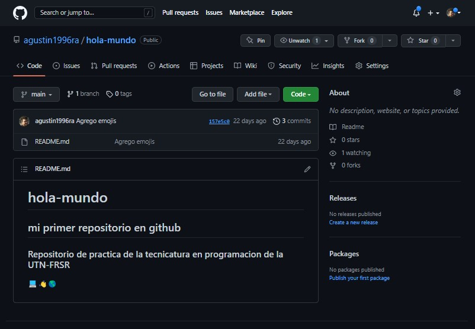
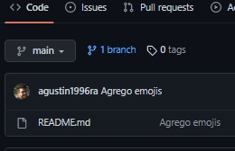
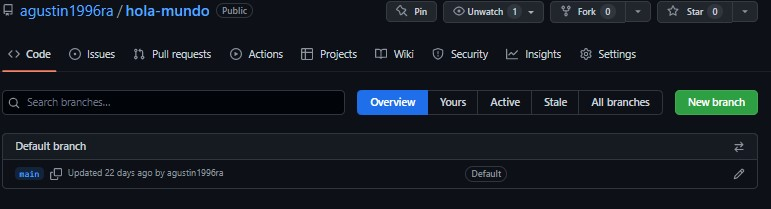
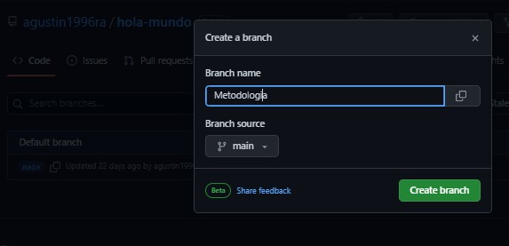
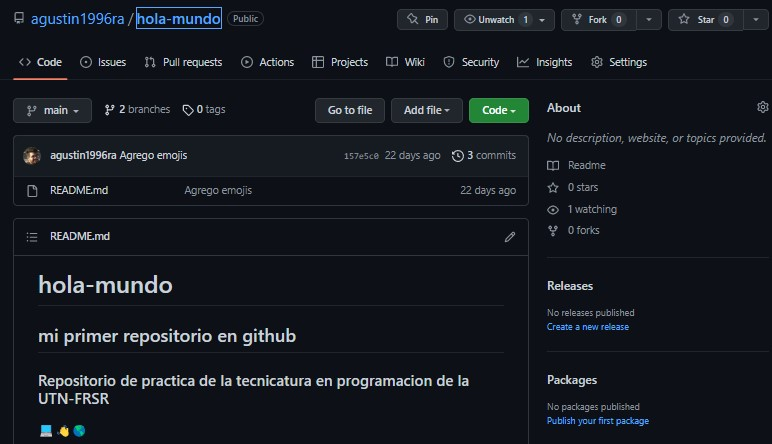
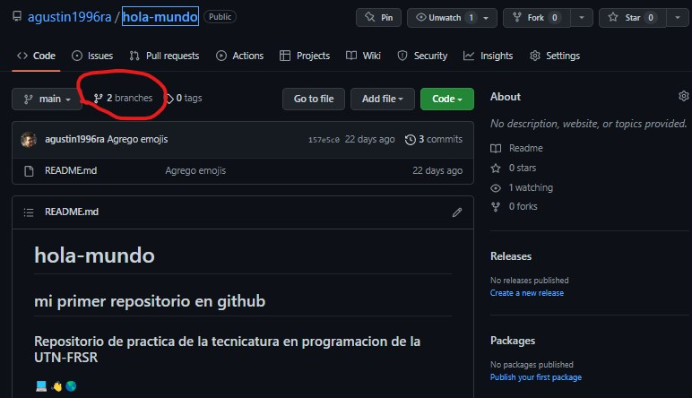
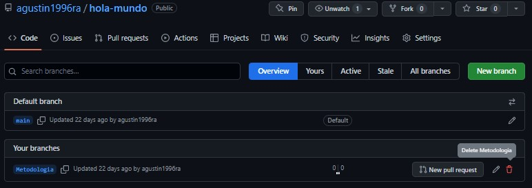
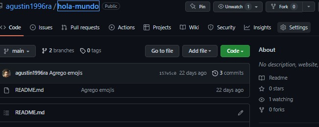
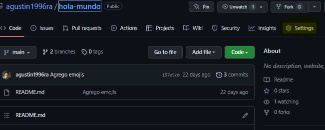
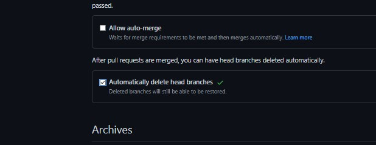

# Clase6 GitHub

## GitHub Ramas

Las ramas te permiten desarrollar características, corregir errores, o experimentar con seguridad las ideas nuevas en una área contenida de tu repositorio.

### Crear una rama a partir de otra rama

- Siempre puedes crear una rama a partir de otra rama existente.
- Habitualmente, puedes crear una rama nueva desde rama predeterminada de tu repositorio.

Podrás entonces trabajar en esta rama nueva aislado de los cambios que otras personas hacen al repositorio.

A la rama que creas para construir una característica.
Se le conoce como una rama de característica o rama de tema.

### Proponer cambios para el proyecto de otra persona 

- Por ejemplo, puedes utilizar ramificaciones para proponer cambios relacionados con arreglar un error. En lugar de registrar una incidencia para un error que has encontrado, puedes hacer lo siguiente.
- Bifurque el repositorio.
- Solucionar el problema.
- Emitir solicitudes de cambios al propietario del proyecto.

### Usar el proyecto de otra persona como inicio de tu propia idea

El software de código abierto de basa en la idea de que, si compartimos el código, podemos crear software más confiable y mejor.

### Creación de ramas en GitHub

- En GitHub vaya a la página principal del repositorio.
- Encima de la lista de archivos haz click en Ramas.

## Creamos Ramas:
### Pasos:
1. En GitHub vaya a la página principal del repositorio.

2. Encima de la lista de archivos, haga clic en branch / rama

3. Hacemos click en New Branch / Nueva Rama

4. En el cuadro de diálogo, escriba el nombre de la rama y, opcionalmente, cambie el origen de la rama.

5. Hacemos click en Create branch / crear rama

## Eliminar rama desde GitHub
Para eliminar una rama realizaremos los siguientes pasos:
1. Nos volvemos a ubicar en la página principal de nuestro repositorio

2. Encima de la lista de archivos, haga click en branch / rama

3. Desplácese hasta la rama que desea eliminar y, a continuación, haga click en el tacho de basura.

4. Nos figurará la acción realizada en la rama eliminada.

## Eliminar ramas de forma automática
Cualquier persona con permisos de administrador para un repositorio puede habilitar o deshabilitar la eliminación automática de ramas.

Pasos para configurar eliminación de ramas de forma automática.

1. Abrimos la página principal de nuestro repositorio

2. Debajo del nombre del repositorio, haga click en Settings / configuración.

3. "Solicitudes de extracción", seleccione o anule la selección de **Eliminar automáticamente las ramas principales.**

## Ramas protegidas
Los administradores de repositorios pueden habilitar protecciones en una sucursal. Si está trabajando en una rama que está protegida, no podrá eliminar ni forzar la inserción en la rama. Los administradores de repositorios también pueden habilitar variar otras configuraciones de sucursal protegidas para aplicar varios flujos de trabajo antes de que se pueda combinar una rama.

# Actividad n°3
1. Responder cuestionario para asistencia en el campus
2. Realizar actividades 1 y 2
3. Trabajo grupal: Responder las siguientes preguntas. Fecha de entrega 05-10
    1. ¿Qué me permite trabajar en las ramas creadas en GitHub?
    2. ¿Cualquier desarrollador puede manipular los proyecto que subimos a GitHub?
    3. Enumerar los pasos para clonar un repositorio a nuestro equipo (visto la clase anterior)
    4. Enviar un trabajo por grupo en formato Word o PDF, se puede acompañar de capturas.
