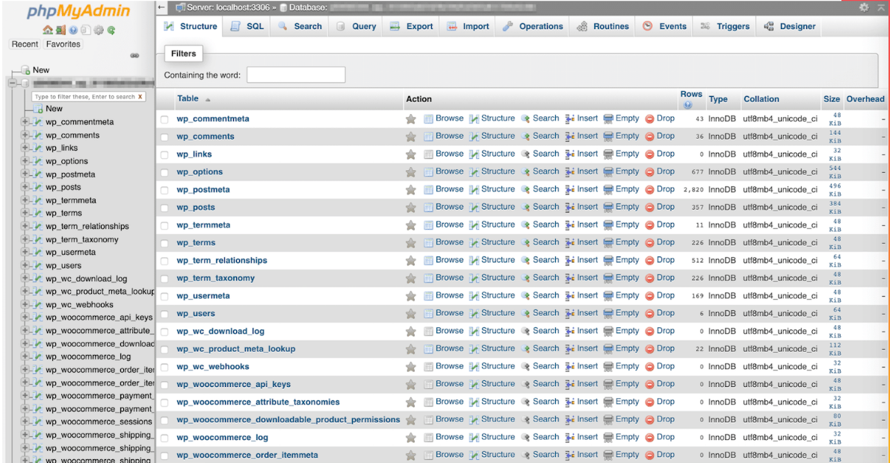
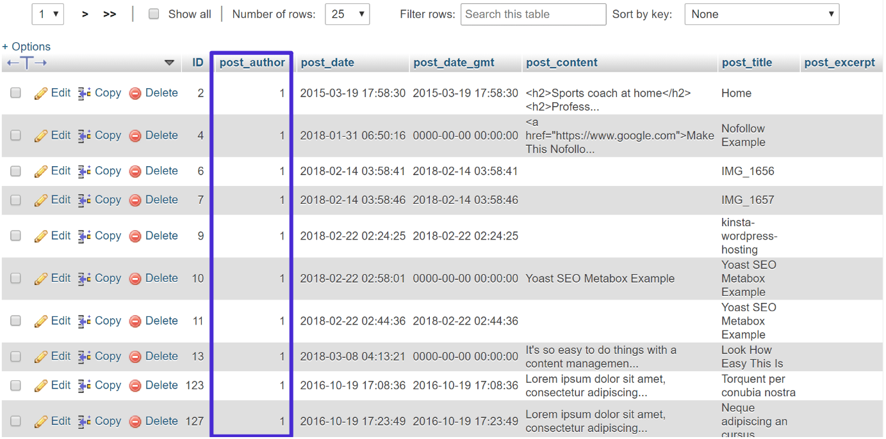
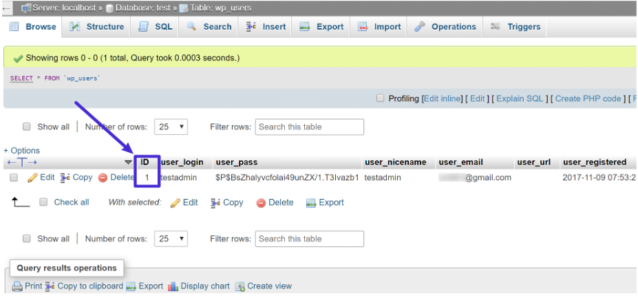

# MySQL
Es un sistema open sourse de administración de bases de datos que es desarrollado y soportado por Oracle.

## Su orígen
MySQL fue originalmente lanzado en 1995. Desde entonces, ha pasado por varios cambios de propiedad/administración, antes de terminar en la Oracle Corporation en 2010. A pesar de que Oracle está a cargo ahora, MySQL sigue siendo un software open source, lo que quiere decir que usted puede usarlo y modificarlo a su gusto.

El nombre viene de juntar "My" (el nombre de la hija del co-fundador) con la abrebiatura SQL (Strucutred Query Language), el cual es el lenguaje de programación que le ayuda a acceder y administrar datos en una base de datos relacional.

Para poder entender como funciona MySQL, es importante conocer dos conceptos conectados: 
- Base de datos relacionales
- Modelo cliente-servidor

## Base de datos relacionales

Cuando se trata de almacenar datos en una base de datos, hay distintos enfoques que usted puede utilizar.

MySQL opta por un enfoque llamado una base de datos realcional.

Con una base de datos relacional, sus datos son fragmentados en varias áreas de almacenamiento separadas, llamadas tablas, en lugar de poner todo junto rn una gran unidad de almacenamiento.

Por ejemplo, digamos que quiere almecenar dos tipos de información:
- Clientes: su nombre, dirección, detalles, etc.
- Pedidos: como los productos que compran, el precio, quien hizo la orden, etc.

### Si intenta poner todos estos datos juntos en un gran bote, tendrá algunos problemas como:
- Datos distintos: Los datos que usted necesita para recolectar para una orden son diferentes que los que son para un cliente
- Datos duplicados: Cada cliente tiene un nombre, y cada orden también tiene el nombre del cliente. El lidiar con datos duplicados suele ser complicado
- Sin organización: ¿cómo se conecta uno de forma concisa la información de un pedido con la información de un cliente?

### Para resolver estos problemas:
Una base de datos relacional usaría una tabla separada para los clientes y otra tabla separada para las ordenes. 

Sin embargo, usted querrá poder decir "muéstreme todas las ordenes para un determinado cliente". Aquí es donde entra la parte **relacional**.

## Llave 
- Al usar una "llave", usted podrá enlazar los datos, usted verá qué utiliza este modelo relacional, con todos sus datos divididos en tablas separadas.

- Por defecto, WordPress utiliza 12 tablas separadas, pero muchos plugins de WordPress también agregarán sis propias tablas.

## WordPress
Almacena publicaciones de blog en la tabla de `wp_posts` y los usuarios en la tabla de `wp_users`. Sin embargo, porque esas dos tablas están conectadas por una llave usted podrá enlazar cada cuenta de usuario con todas las publicaciones de blog que cada usuario ha escrito.

Así es como luce la base de datos:

### Cada publicación es asignada a post_author, la cual es un número único de identificación (esta es la llave):

### Luego, si quiere ver qué cuenta de usuario corresponde a ese número, usted podría ver la ID en la tabla de `wp_users`:

### La llave (numero id) es lo que conecta todo. Y así es como se relacionan una con otra, a pesar de almacenar los datos en tablas separadas.

## Modelo de cliente-servidor
Más allá del sistema de bases de datos relacional. MySQL también utiliza algo llamado el modelo cliente-servidor.

La parte de servidor es donde sus datos realmente residen. Pero, para poder acceder a estos datos, usted deberá pedirlos. Aquí es donde entra el cliente.

Usando SQL (el lenguaje de programación que mencionamos anteriormente) el cliente envía una petición al servidor de la base de datos para los datos que el cliente necesita.

Por ejemplo, si alguien visita una publicación de un blog en su sitio, su sitio de WordPress enviará múltiples peticiones SQL al servidor de la base de datos para obtener toda la información que necesita para entregar la publicación del blog al navegador del visitante.

Haría:
- Consulta a la tabla `wp_posts` para obtener contenido para la publicación del blog
- Consulta a la tabla de `wp_users` para obtener información para la casilla del autor (utilizando la llave id)

Si quiere ver exactamente qué tipos de peticiones de bases de datos son hechas pos su sitio de WordPress, usted puede utilizar un maravilloso plugin llamado **Query Monitor** para ver la interacción exacta entre su sitio de WordPress (el cliente) y el servidor de la base de datos.

## Ventajas 
- Ahorra tiempo, costes y maximiza el rendimiento del sitio
- Ayuda instantánea de expertos en alojamiento de WordPress
- Integración de Cloudflare Enterprise
- Alcance de audiencia global con 35 centros de datos en todo el mundo
- Optimización con nuestra herramienta de monitoreo de rendimiento de aplicación integrada

- Es libre y gratuito
- Los requisitos para crear y usar una base de datos son relativamente escasos
- Relacionado con el punto anterior, no es necesario contar con un ordenador muy poderoso para base de datos normales
- Es muy rápido y fácil de usar
- Lo soportan casi todos los sistemas operativos
- Las probabilidades de corrupción de datos son muy bajas
- Es muy seguro

