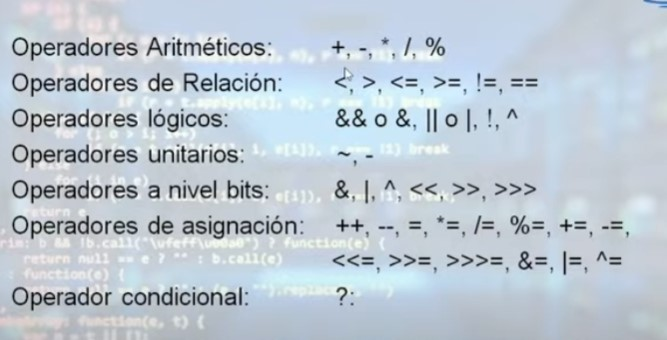
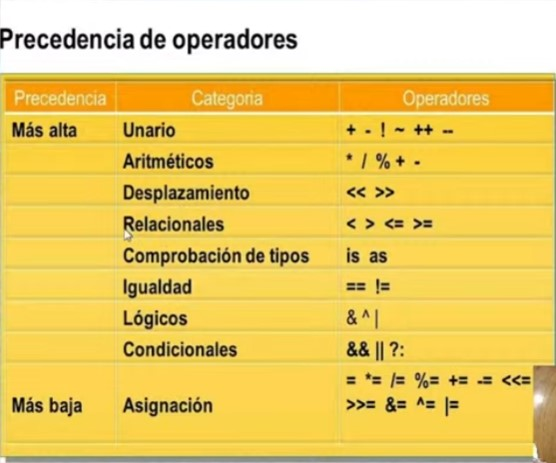

# Clase 7

> Notas:
> - De ahora en más tendremos que responder más a conciencia la resolución de la evaluación de asistencia. Ya que ahora constara para la nota de la materia.
> - No entregamos el ejercicio de la tienda de libros junto con el cuestionario.
> - mail del profe: betancudariel@gmail.com
> - Ejercicio de resolución en clase par ver el resultado todos juntos.

## Operadores:

### operadores y su precedencia

