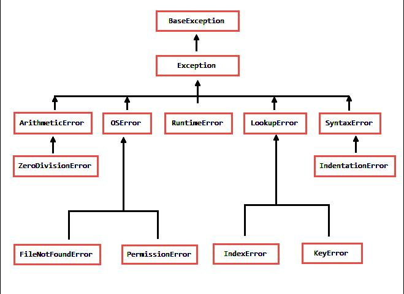

# Python - Laboratorio 3

## Clase1 - Excepciones

Vamos a trabajar sobre excepciones en python en un
nuevo proyecto llamado [Lección 1](./Leccion1).

En la siguiente imagen podemos ver un árbol de jerarquías de
clases de excepciones.

La clase padre de todas las excepciones es `BaseException`,
luego la clase `Exception` hereda todas las características de
su clase padre. A la hora de trabajar capturando excepciones
mayormente, usaremos `Exception`.
Ya que al utilizar `Exception` capturamos todas las excepciones
de sus clases hijas.
